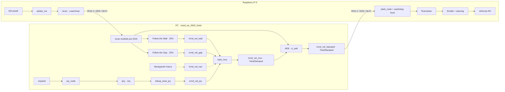

# RC Ackermann Bringup — Integración, AEB y puesta en servicio

## Estado actual

La integración de software del **Automatic Emergency Braking (AEB)** está
implementada en `hotel_bringup` **en el PC**, después del selector de comandos `twist_mux` y
antes de la única interfaz de hardware `ybeb_node`.

| Elemento | Estado verificado |
|---|---|
| `colcon build` | **PASS** en el computador de desarrollo |
| Pruebas de referencia previas | **60 aprobadas, 0 fallidas, 1 omitida**; 0 errores |
| Pruebas de migración Hotel | Ver [Validación realizada](#validación-realizada) y [TEST_REPORT](docs/TEST_REPORT.md) |
| AEB | Validado en software con entradas sintéticas y hardware en memoria |
| Vehículo real | **Aceptación física supervisada pendiente** |
| Follow the Wall | Aproximadamente **25%**, prototipo sin tuning físico |
| Follow the Gap | Aproximadamente **25%**, prototipo sin tuning físico |
| Navegación completa | Fuera de esta fase; sólo se reserva su entrada al mux |

La implementación de referencia fue verificada el **2026-09-26** y sus pruebas
se migraron a Hotel. El informe distingue esa referencia de la nueva validación. No se ha
acreditado AEB al 100% en el carro real. Las velocidades y dimensiones
provisionales no son mediciones. `calibration_confirmed` permanece en `false`.

## Índice

- [Estado actual](#estado-actual)
- [Alcance y ubicación](#alcance-y-ubicación)
- [Arquitectura](#arquitectura)
- [Contrato de control del vehículo](#contrato-de-control-del-vehículo)
- [Archivos creados](#archivos-creados)
- [Archivos modificados](#archivos-modificados)
- [Automatic Emergency Braking — AEB](#automatic-emergency-braking--aeb)
- [Watchdog independiente del hardware](#watchdog-independiente-del-hardware)
- [Configuración de twist_mux](#configuración-de-twist_mux)
- [Joystick](#joystick)
- [RPLIDAR y QoS](#rplidar-y-qos)
- [Tópicos y tipos de mensaje](#tópicos-y-tipos-de-mensaje)
- [Validación realizada](#validación-realizada)
- [Pruebas físicas pendientes](#pruebas-físicas-pendientes)
- [Procedimiento de puesta en servicio](#procedimiento-de-puesta-en-servicio)
- [Calibración de velocidad](#calibración-de-velocidad)
- [Calibración de distancia de parada](#calibración-de-distancia-de-parada)
- [Follow the Wall y Follow the Gap](#follow-the-wall-y-follow-the-gap)
- [Troubleshooting](#troubleshooting)
- [Documentos detallados](#documentos-detallados)
- [Seguridad](#seguridad)

## Alcance y ubicación

**Fuente de verdad:** `/home/lenovo/mrad_ws_2602_hotel`.
**Repositorio Git:** `/home/lenovo/mrad_ws_2602_hotel/src`.
**README principal:** `src/hotel_bringup/README.md`.

La implementación anterior en
`/home/lenovo/proyecto_rc/raspberry_pi_5_backup/ros2_ws_2602/src/ybeb_2602_zulu`
se conserva intacta como respaldo/referencia validada. No es la fuente principal
ni debe seguirse su antigua distribución de procesos entre PC y Pi. El workspace
`ros2_ws_2601` también permanece intacto. Los cambios previos del usuario en Hotel
no se sustituyen ni se restauran mediante checkout/reset.

Se reutilizan TTC, histéresis, límites, watchdog, configuraciones y tests; no se
rediseñan los algoritmos. El AEB RC sustituye al ejecutable principal `aeb_node`
de Hotel. El AEB histórico se conserva como `aeb_legacy_node.py` y ejecutable
`aeb_legacy_node`; cuatro launch históricos se redirigen a él para conservar su
comportamiento. No ejecutar esos launch simultáneamente con el bringup RC real.
Los YAML de simulación no se sobrescriben.

No se añaden navegación completa, SLAM, AMCL, Pure Pursuit ni simuladores a la
cadena RC. El paquete de hardware se versionará junto al resto del código, pero
sólo se ejecuta con Rosmaster en la Pi. Sus imports y build no abren dispositivos.

## Arquitectura



**AEB está DESPUÉS de `twist_mux`.** No es una entrada competidora del mux:
interviene sobre la salida seleccionada, provenga de joystick, Wall, Gap o futura
navegación. La prioridad del joystick no permite saltarse el AEB.

El launch RC tiene un solo publicador previsto para `/cmd_vel_stamped`: AEB.
Esto describe el grafo previsto; no implementa permisos de acceso DDS. Antes de
alimentar motores hay que descartar otros publicadores o un bringup antiguo
activo. No ejecutar simultáneamente el launch Hotel ni dos `ybeb_node`.

### Responsabilidades y condiciones de arranque

| Equipo | Ejecuta | No ejecuta en esta arquitectura |
|---|---|---|
| PC | joy, teleop, mux, AEB, Wall/Gap opcionales; navegación futura | Rosmaster, actuadores, driver LiDAR conectado a Pi |
| Raspberry | ybeb, Rosmaster, watchdog local; RPLIDAR si está conectado allí | mux, AEB, Wall/Gap ni navegación |

`/scan` viaja Pi → PC; `/cmd_vel_stamped` viaja PC → Pi. No se necesitan bridges
si DDS descubre ambos equipos. Ante caída del PC, Wi-Fi o AEB, el watchdog local
sigue siendo responsable de neutralizar la última orden en la Raspberry.

| Launch | Paquete/equipo | Argumentos actuales |
|---|---|---|
| `rc_pc_bringup.launch.py` | `hotel_bringup`, PC | `start_joystick=false`, `start_wall=false`, `start_gap=false`, `linear_scale=0.1`, `steering_scale=0.25`, `steering_axis=3`, `calibration_confirmed=false`, `aeb_config`, `wall_config`, `gap_config` |
| `joystick_rc.launch.py` | `hotel_bringup`, PC | `linear_scale=0.1`, `steering_scale=0.25`, `steering_axis=3` |
| `wall_rc.launch.py` | `hotel_wall_following`, PC | `wall_config`, por defecto el YAML instalado `wall_rc.yaml` |
| `gap_rc.launch.py` | `hotel_ttc_follow_the_gap`, PC | `gap_config`, por defecto el YAML instalado `gap_rc.yaml` |
| `rc_pi_bringup.launch.py` | `ybeb_2602_zulu`, Pi | `start_lidar=false`, `start_hardware=false`, `hardware_config` |
| `rplidar.launch.py` | `ybeb_2602_zulu`, Pi | Sin argumentos declarados; conserva puerto y parámetros |

El PC arranca mux/AEB; no importa Rosmaster para construir sus nodos. Iniciar
Wall/Gap opcionalmente no los habilita: requieren heartbeat explícito. La Pi no
abre dispositivos por defecto; el operador habilita cada driver deliberadamente.
`use_sim_time=false` es obligatorio en nodos RC.

`aeb_config` apunta al YAML instalado `share/hotel_bringup/config/aeb_rc.yaml`.
El argumento `calibration_confirmed` del launch sobrescribe el YAML: cambiar sólo
el YAML a true no habilita el bringup si se conserva el argumento false.

## Contrato de control del vehículo

En este RC, `geometry_msgs/msg/TwistStamped` transporta comandos normalizados:

| Campo real del mensaje | Semántica | Límite absoluto actual |
|---|---|---:|
| `twist.linear.x` | Throttle normalizado | `[-0.4, +0.4]` |
| `twist.angular.z` | Steering normalizado | `[-0.5, +0.5]` |

No deben interpretarse como m/s ni rad/s, ni utilizar `angular.z` como yaw-rate
en la interfaz final del RC. Los otros componentes no accionan el vehículo, pero
se exige que **todos los seis componentes** del Twist sean finitos.

Hay saturación explícita tanto en AEB como en ybeb. Una orden válida dentro del
contrato conserva throttle y steering al pasar por AEB sin riesgo; la salida se
republica con un header nuevo a 25 Hz, no es una copia byte a byte del mensaje.

Calibración preservada en `servo_values()` de [safety_core.py](../ybeb_2602_zulu/ybeb_2602_zulu/safety_core.py):

```text
Throttle, canal 1: PWM = 91 + 27 * linear.x
Neutral: 91
Rango de la consigna PWM: 80.2 … 101.8

Steering, canal 4: PWM = 127.5 + 105 * angular.z
Centro aproximado: 127.5
Rango de la consigna PWM: 75 … 180
```

Estos números son consignas de la API Rosmaster; no se documentan como
microsegundos de pulso. En la biblioteca Rosmaster del respaldo,
`set_pwm_servo()` convierte el valor con `int(angle)` antes de transmitirlo.
Por tanto el centro 127.5 termina como 127, y los extremos throttle como 80 y 101.
Debe confirmarse que la biblioteca instalada en la Pi coincide. Conservar esta
calibración de código no demuestra neutral mecánico/eléctrico del ESC real.

## Archivos creados

Rutas relativas al repositorio `src`. Se distribuye el código validado en sus
paquetes responsables y se comparte la validación sin duplicar drivers.

| Archivo o grupo | Función |
|---|---|
| `hotel_bringup/hotel_bringup/safety_core.py` | Estado AEB, parámetros TTC, retención de riesgo, coast e histéresis. |
| `hotel_bringup/hotel_bringup/aeb_legacy_node.py` | Copia exacta del AEB histórico para los launch anteriores. No usar en RC. |
| `hotel_bringup/config/aeb_rc.yaml` | Parámetros AEB reales separados de simulación. |
| `hotel_bringup/config/twist_mux_rc.yaml` | Cuatro fuentes stamped y sus prioridades. |
| `hotel_bringup/config/joystick_rc.yaml` | Ejes, escalas y deadman RC. |
| `hotel_bringup/launch/rc_pc_bringup.launch.py` | Integración del PC, sin hardware ni Gazebo. |
| `hotel_bringup/launch/joystick_rc.launch.py` | Joystick RC independiente. |
| `hotel_bringup/test/test_rc_safety_core.py` | Los 42 casos de lógica de seguridad previos. |
| `hotel_bringup/test/test_rc_contracts.py` | Los 8 casos previos de frescura, imports y empaquetado, adaptados a las nuevas rutas. |
| `hotel_bringup/test/test_rc_ros_pipeline.py` | Cadena ROS PC + FakeRobot, arbitraje, teleop, QoS y watchdog. |
| `hotel_bringup/test/test_rc_reactive.py` | Los 7 casos de comportamiento y cesión de control, ahora sobre los paquetes Wall/Gap. |
| `hotel_bringup/test/test_rc_migration.py` | Separación PC/Pi, defaults compartidos, regresión de giro fijo y estilo del código RC. |
| `hotel_bringup/README.md` | Documento principal de integración. |
| `hotel_bringup/docs/AEB_AUDIT.md` | Auditoría histórica y adaptación a la nueva arquitectura. |
| `hotel_bringup/docs/RC_RUNBOOK.md` | Operación y despliegue PC/Pi. |
| `hotel_bringup/docs/TEST_REPORT.md` | Resultados, cobertura y limitaciones. |
| `hotel_wall_following/hotel_wall_following/rc_core.py` | Geometría de pared derecha y mando normalizado. |
| `hotel_wall_following/hotel_wall_following/rc_node.py` | Ejecutable `rc_wall_node`. |
| `hotel_wall_following/hotel_wall_following/rc_support.py` | Transporte ROS compartido con Gap: scan fresco, enable con caducidad y silencio al desactivar. |
| `hotel_wall_following/config/wall_rc.yaml`, `launch/wall_rc.launch.py` | Configuración y launch RC de pared. |
| `hotel_ttc_follow_the_gap/hotel_ttc_follow_the_gap/rc_core.py` | Selección de huecos y burbuja, sin giros forzados. |
| `hotel_ttc_follow_the_gap/hotel_ttc_follow_the_gap/rc_node.py` | Ejecutable `rc_gap_node`. |
| `hotel_ttc_follow_the_gap/config/gap_rc.yaml`, `launch/gap_rc.launch.py` | Configuración y launch RC de Gap. |
| `ybeb_2602_zulu/ybeb_2602_zulu/ybeb_node.py` | Interfaz única Rosmaster y watchdog local, código validado conservado. |
| `ybeb_2602_zulu/ybeb_2602_zulu/safety_core.py` | Límites, watchdog y conversión PWM compartidos, sin acceso a hardware. |
| `ybeb_2602_zulu/ybeb_2602_zulu/scan_support.py` | Scan, calidad y proyección geométrica extraídos sin cambiar la fórmula. |
| `ybeb_2602_zulu/ybeb_2602_zulu/ros_support.py` | Parámetros y validación de sellos/componentes compartidos. |
| `ybeb_2602_zulu/config/hardware_rc.yaml` | Parámetros del watchdog y límites de hardware. |
| `ybeb_2602_zulu/launch/rc_pi_bringup.launch.py`, `launch/rplidar.launch.py` | Arranque exclusivo de drivers en Pi. |
| `ybeb_2602_zulu/setup.py`, `package.xml`, `setup.cfg`, `resource/ybeb_2602_zulu`, `ybeb_2602_zulu/__init__.py`, `README.md`, `test/test_{copyright,flake8,pep257}.py` | Empaquetado independiente desplegable y pruebas de estilo; copyright omitido heredado. |

El paquete hardware no depende de `hotel_bringup`, Wall ni Gap: se puede copiar
solo a la Pi. El PC reutiliza utilidades puras de ese paquete sin crear Rosmaster.
Gap reutiliza el transporte de Wall; cada algoritmo reside en su propio paquete.

## Archivos modificados

| Archivo relativo a `src` | Cambio |
|---|---|
| `hotel_bringup/hotel_bringup/aeb_node.py` | AEB RC robusto migrado; salida final `/cmd_vel_stamped`. |
| `hotel_bringup/setup.py`, `package.xml` | Dependencias PC/hardware compartido, ejecutable histórico separado, instalación de README/docs y configuraciones/launch. |
| `hotel_bringup/launch/ackermann.launch.py`, `ackerman_gz.launch.py`, `gz_spawn.launch.py`, `hotel_joy.launch.py` | Sólo sustituyen el ejecutable AEB histórico por `aeb_legacy_node`. |
| `hotel_wall_following/setup.py`, `package.xml` | Registran `rc_wall_node` y sus dependencias. |
| `hotel_ttc_follow_the_gap/setup.py`, `package.xml` | Registran `rc_gap_node` y transporte compartido. |
| `hotel_ttc_follow_the_gap/hotel_ttc_follow_the_gap/ttc_control.py` | Elimina también en el controlador histórico las ramas que forzaban ±1.4. Sus escalas de simulación no se usan para el RC. |

El `wall_following.launch.py` que ya estaba modificado por el usuario queda
intacto. También se conservan los resultados, archivos sin seguimiento y fuentes
ajenas a esta integración. La licencia TODO y los tests heredados de copyright
no se alteran. El hardware migrado mantiene watchdog, isfinite, límites y shutdown.

# Automatic Emergency Braking — AEB

## Entradas, salida y cálculo TTC

El nodo ROS se llama `rc_aeb` y su ejecutable es `aeb_node`.

- Entrada de control: `/cmd_vel_mux`, `geometry_msgs/msg/TwistStamped`.
- Entrada de percepción: `/scan`, `sensor_msgs/msg/LaserScan`.
- Única salida de control del AEB: `/cmd_vel_stamped`, `geometry_msgs/msg/TwistStamped`.
- Diagnósticos: `/aeb/active`, `/aeb/reason`, `/aeb/ttc`.

El ángulo se obtiene de `angle_min + índice * angle_increment`, más la corrección
configurada `lidar_yaw_deg`. Para cada dirección de movimiento se selecciona su
sector delantero o trasero y se aplica:

```text
v_proyectada = v * cos(ángulo)
TTC = max(0, rango - radio) / v_proyectada
```

Participan sólo rayos dentro del FOV direccional, con rango finito dentro de
`[range_min, range_max]` y `v_proyectada > min_closing_speed_mps` (0.01 m/s).
Se toma el mínimo TTC. No hay división por cero: rayos con proyección nula,
negativa o demasiado pequeña no participan en el mínimo. Si el rango válido
está dentro del radio y hay aproximación, su TTC es cero.

Se reutiliza la proyección del AEB Hotel y su umbral histórico 0.45 s. No se
reutilizan su conversión `2.11*throttle-2.21`, su contracorriente de hasta -2 ni
su condición fija de distancia 1.4 m. El RC neutraliza throttle ante riesgo;
no manda reversa como freno.

## Velocidad, reversa, coast y límites del modelo

No hay una velocidad física medida conectada al AEB. Para cualquier demanda no
nula se usa la **cota completa** de velocidad configurada para ese sentido, no
el throttle como m/s ni una multiplicación throttle × cota:

- Adelante: `v=+forward_speed_bound_mps` y sector frontal.
- Atrás: `v=-reverse_speed_bound_mps` y sector trasero.
- Sin demanda, movimiento reciente ni riesgo retenido: `v=0`, TTC infinito;
  aun así se exige calidad del scan frontal.
- Tras una orden de movimiento realmente permitida, se conserva su dirección
  durante `coast_timeout`, aunque se suelte throttle o se cambie su signo.
- Una colisión conserva sus direcciones de riesgo hasta despejarse; poner el
  comando a cero o pedir reversa no borra automáticamente una colisión frontal.

Con cotas superiores verificadas, el TTC resulta conservador para la aproximación
longitudinal a obstáculos estáticos. **2.0 m/s y 1.0 m/s son valores provisionales**.
El modelo no predice el barrido completo de una trayectoria Ackermann con giro,
ni mide la velocidad relativa de obstáculos móviles. Un obstáculo exactamente
lateral a ±90° no aporta aproximación longitudinal; eso no prueba que todos los
obstáculos laterales sean inocuos al girar. La primera aceptación en suelo debe
ser recta y con obstáculos estáticos.

## Calidad y frescura de las entradas

| Situación | Tratamiento implementado |
|---|---|
| NaN o ±inf en `ranges` | Lectura desconocida; no participa en TTC. Aislados pueden tolerarse si el sector supera los criterios de calidad. |
| Rango menor que `range_min` o mayor que `range_max` | Inválido; tampoco significa camino libre. Los extremos exactos sí son admitidos. |
| Todos los rangos inválidos, scan vacío o insuficiente | STOP; no se conserva como evidencia el último scan claro. |
| Metadatos no finitos, incremento cero, límites incorrectos o ángulos inconsistentes | STOP. |
| Cobertura angular incompleta o tramo inválido demasiado largo | STOP aunque haya suficientes lecturas en otra zona. |
| Scan antiguo | Vida útil limitada por edad del header y timeout; STOP al caducar. |
| Scan repetido o fuera de orden | Se exige sello estrictamente creciente; se invalida la entrada. |
| Frame distinto de `scan_frame` | STOP; no se aplica TF automáticamente para corregirlo. |
| Velocidad cero | No se divide por cero; TTC infinito si no queda movimiento/riesgo retenido. |
| Reversa sin cobertura trasera suficiente | STOP. |
| Pérdida de `/scan` | Neutral periódico al caducar `scan_timeout`. |
| Pérdida de `/cmd_vel_mux` | Neutral periódico al caducar `command_timeout`. |
| NaN/inf en cualquier componente del comando | Se invalida toda la orden y se neutraliza. |
| Header cero, negativo/mal formado, demasiado antiguo o excesivamente futuro | Se rechaza como entrada utilizable. |

La edad del header se calcula con el reloj ROS real; el plazo local y el timer
usan reloj monotónico/STEADY_TIME. La vida útil restante no supera el timeout ni
se renueva completamente por recibir tarde un mensaje viejo. Los scans se
comprueban además contra el último sello aceptado. Sincronizar PC/Pi es necesario.

## Parámetros actuales del AEB

Fuente: [config/aeb_rc.yaml](config/aeb_rc.yaml), `AEBConfig` y `AEBNode`.

**Leyenda:** ✅ confirmado en archivos y/o tests de software, **no** certificación
física; ⚠️ provisional como elección para el RC; ❌ calibración/aceptación física
todavía pendiente. Todos los valores están verificados en el código; el estado
indica qué evidencia existe para usarlos físicamente.

| Parámetro | Valor actual | Estado y uso |
|---|---:|---|
| `use_sim_time` | `false` | ✅ Requisito de los nodos RC. |
| `calibration_confirmed` | `false` | ✅ Bloqueo activo; ❌ completar calibración antes de true. |
| `ttc_threshold` | `0.45` s | ✅ Histórico y testeado; ❌ validar distancia de parada real. |
| `release_ttc_threshold` | `0.65` s | ✅ Histéresis testeada; ⚠️ margen inicial. |
| `release_hold_time` | `0.3` s | ✅ Lógica testeada; ⚠️ valor inicial para pista. |
| `release_scan_count` | `3` | ✅ Scans distintos, no ticks del timer. |
| `scan_timeout` | `0.3` s | ✅ Caducidad testeada; ❌ comprobar tasa/latencia del LiDAR real. |
| `command_timeout` | `0.3` s | ✅ Caducidad testeada; ❌ comprobar Wi-Fi real. |
| `future_stamp_tolerance` | `0.1` s | ✅ Rechazo de sellos futuros; ❌ comprobar sincronización. |
| `output_rate` | `25.0` Hz | ✅ Timer configurado; ❌ medir frecuencia efectiva en Pi. |
| `throttle_limit` | `0.4` | ✅ Saturación `[-0.4,+0.4]`; no identifica velocidad física. |
| `steering_limit` | `0.5` | ✅ Saturación `[-0.5,+0.5]`; ❌ confirmar recorrido mecánico. |
| `footprint_radius_m` | `0.45` m | ⚠️ Heredado/provisional; ❌ medir envolvente desde el LiDAR. |
| `forward_speed_bound_mps` | `2.0` m/s | ⚠️ Provisional; ❌ cota física sin medir. |
| `reverse_speed_bound_mps` | `1.0` m/s | ⚠️ Provisional; ❌ cota física sin medir. |
| `coast_timeout` | `1.0` s | ⚠️ Provisional; ❌ medir rodadura a neutral. |
| `front_fov_deg` | `180.0`° | ✅ FOV total, ±90° del frente; ❌ comprobar cobertura. |
| `rear_fov_deg` | `180.0`° | ✅ FOV total, ±90° de la parte trasera; ❌ comprobar cobertura. |
| `lidar_yaw_deg` | `0.0`° | ⚠️ Supone 0° hacia adelante; ❌ medir montaje. |
| `scan_frame` | `laser_frame` | ✅ Coincide con el launch LiDAR; ❌ confirmar endpoint real. |
| `output_frame` | `base_link` | ✅ Header de la salida AEB. |
| `min_valid_readings` | `5` | ✅ Mínimo por sector; ⚠️ criterio inicial de calidad. |
| `min_valid_fraction` | `0.3` | ✅ Mínimo 30% por sector; ⚠️ validar condiciones reales. |
| `max_invalid_gap_deg` | `10.0`° | ✅ Máximo tramo contiguo inválido; ⚠️ validar cobertura. |
| `min_closing_speed_mps` | `0.01` m/s | ✅ Sólo aproxima si supera este valor. |
| `brake_steering_mode` | `hold` | ✅ Conserva steering comandado al colisionar; alternativa `center`. |
| `fail_safe_steering` | `0.0` | ✅ Salida ante fallos; ❌ confirmar centro físico. |

El radio debe contener el vehículo respecto del origen del LiDAR, no sólo media
anchura del chasis. Reducirlo sin medir reduce el margen. Cambiar FOV, tolerancia
de inválidos o velocidad para eliminar un bloqueo no sustituye identificar su causa.

Los parámetros propios se declaran de sólo lectura. Para una calibración futura,
detener y relanzar con el YAML revisado; el launch admite `aeb_config`. No usar
`ros2 param set` para intentar alterar estos parámetros durante movimiento.

## Histéresis y liberación

Se activa la retención de colisión cuando `TTC <= 0.45 s`. Subir ligeramente por
encima de 0.45 no la libera. Se exige simultáneamente:

1. `TTC >= release_ttc_threshold` (0.65 s).
2. Al menos `release_scan_count` scans distintos (3).
3. `release_hold_time` de despeje (0.3 s) desde el inicio del conteo.

Los ticks del timer no cuentan como nuevos scans. Un TTC intermedio, nuevo peligro
o fallo de datos interrumpe el conteo. Esto evita chatter alrededor del umbral.
Durante `collision`, `linear.x=0`; `hold` conserva el steering seleccionado y
`center` utiliza el steering seguro configurado, actualmente cero.

Si el operador sigue pidiendo movimiento cuando se despeja el riesgo, AEB puede
reanudar después de cumplir esas condiciones. **Soltar deadman/throttle antes de
retirar el obstáculo durante las pruebas.**

## Comportamiento Fail-Safe

**Ante incertidumbre relevante → STOP**, expresado como throttle neutral. La salida
periódica a 25 Hz sigue produciéndose aunque dejen de llegar las dos entradas.
Se neutraliza por falta/caducidad de scan, calidad insuficiente, frame/sello
incorrecto, falta/caducidad de comando, comando no finito o calibración no confirmada.
Un scan inválido provoca parada desde el primer dato evaluado; no se espera una
secuencia prolongada. El steering ante esos fallos es `fail_safe_steering=0`.

`/aeb/active=true` abarca tanto colisión como fallos de entrada/calibración. Los
motivos exactos permiten distinguirlos. **Un `/aeb/ttc=inf` no demuestra por sí
solo camino libre**: también aparece al no poder evaluar o no estar calibrado.
Con `calibration_confirmed=false`, `calibration_required` tiene precedencia sobre
otros fallos; hay que inspeccionar scan/comandos directamente antes de habilitar.

## Watchdog independiente del hardware

La Raspberry ejecuta `ybeb_node` del paquete [ybeb_2602_zulu](../ybeb_2602_zulu/README.md).
Recibe el comando final del PC por `/cmd_vel_stamped` y aplica una segunda barrera:

```text
PC: twist_mux → AEB → DDS/Wi-Fi → Raspberry: ybeb watchdog → Rosmaster → actuadores
```

| Parámetro de `hardware_rc.yaml` | Valor actual |
|---|---:|
| `command_timeout` | 0.25 s |
| `output_rate` | 20 Hz |
| `future_stamp_tolerance` | 0.1 s |
| `throttle_limit` | 0.4 |
| `steering_limit` | 0.5 |
| `watchdog_steering` | 0.0 |
| `use_sim_time` | false |

La edad se comprueba antes de actuar, con reloj monotónico y vida útil del header.
El nodo valida `isfinite` en todos los componentes, satura ambos mandos, escribe
neutral al iniciar, al caducar y ante orden inválida. Intenta neutral al terminar
normalmente o por excepción/SIGINT/SIGTERM, antes de cerrar serial. Si la interfaz
serie expone `write_timeout`, se limita a 0.05 s. Conserva telemetría a 10 Hz.

El timeout del mux **no sustituye** este watchdog: el mux arbitra fuentes, pero no
garantiza una publicación de cero cuando todas caducan. El watchdog tampoco depende
de recibir un diagnóstico del AEB. Si desaparece el PC o la red, la Pi debe
neutralizar por caducidad del último comando final.

Un SIGKILL, congelamiento completo del proceso/OS, fallo eléctrico o enlace serie
averiado puede impedir escribir neutral. La biblioteca Rosmaster del respaldo
captura internamente errores de escritura; no hay confirmación de frenado físico
por cada consigna. Para esos fallos hacen falta protección adicional en firmware/ESC
o corte físico. El software no demuestra por sí solo que el vehículo esté inmóvil.

## Configuración de twist_mux

Archivo PC: [config/twist_mux_rc.yaml](config/twist_mux_rc.yaml).
`use_stamped: true`, `use_sim_time: false`, sin locks configurados.

| Tópico | Prioridad | Timeout [s] |
|---|---:|---:|
| `/cmd_vel_joy` | 200 | 0.5 |
| `/cmd_vel_gap` | 150 | 0.5 |
| `/cmd_vel_wall` | 120 | 0.5 |
| `/cmd_vel_nav` | 100 | 0.5 |

El launch remapea `/cmd_vel_out` a `/cmd_vel_mux`. Después, AEB publica
`/cmd_vel_stamped`. Nav es una entrada reservada: no arranca un navegador.
Si la fuente de mayor prioridad calla, una inferior puede tomar control al vencer
su timeout. Por eso no deben habilitarse fuentes autónomas durante aceptación del
joystick/AEB. Soltar deadman no constituye un bloqueo global permanente del mux.

## Joystick

Se ejecuta en PC con [joystick_rc.launch.py](launch/joystick_rc.launch.py) o con
`start_joystick:=true` en el bringup PC, pero no con ambos a la vez.

| Parámetro | Valor |
|---|---|
| `device_id` | 0 |
| `deadzone` | 0.05 |
| `autorepeat_rate` | 20 Hz |
| `sticky_buttons` | false |
| `axis_linear.x` | 1 |
| `scale_linear.x` | 0.10 |
| `axis_angular.yaw` | 3 |
| `scale_angular.yaw` | 0.25 |
| `enable_button` | 4, obligatorio |
| `enable_turbo_button` | -1, deshabilitado |
| `require_enable_button` | true |
| `publish_stamped_twist` | true |
| `frame` | base_link |
| Salida | `/cmd_vel_joy`, TwistStamped |

Las escalas turbo también quedan en 0.10/0.25. El launch sólo permite escalas
positivas y finitas dentro de 0.4/0.5; permite elegir `steering_axis` no negativo.
No se han probado físicamente el Logitech F710 ni su modo X/D. Si `/joy` demuestra
que el eje correcto es 2, relanzar con `steering_axis:=2`. Verificar signos con
tracción sin potencia antes de aceptar el mapeo. Los índices de arrays parten de 0.

## RPLIDAR y QoS

Cuando el LiDAR está conectado a la Raspberry, su driver corre allí y publica
`/scan` hacia el PC. El launch preserva:

```text
Paquete: rplidar_ros
Ejecutable/nombre: rplidar_composition
serial_port: /dev/serial/by-id/usb-Silicon_Labs_CP2102_USB_to_UART_Bridge_Controller_0001-if00-port0
serial_baudrate: 115200
frame_id: laser_frame
inverted: false
angle_compensate: true
```

AEB y los comportamientos usan `qos_profile_sensor_data` (BEST_EFFORT). Pueden
recibir un productor BEST_EFFORT o RELIABLE; esto se verificó con scan sintético
BEST_EFFORT. Falta verificar el driver físico, su frecuencia y las pérdidas Wi-Fi.
El frame se comprueba literalmente; no hay transformación TF automática del scan.
La lectura láser y la última orden deben mantenerse frescas de extremo a extremo.

## Tópicos y tipos de mensaje

| Tópico | Tipo | Productor → consumidor / equipo |
|---|---|---|
| `/joy` | `sensor_msgs/msg/Joy` | joy → teleop, PC |
| `/cmd_vel_joy` | `geometry_msgs/msg/TwistStamped` | teleop → mux, PC |
| `/cmd_vel_wall` | `geometry_msgs/msg/TwistStamped` | Wall → mux, PC |
| `/cmd_vel_gap` | `geometry_msgs/msg/TwistStamped` | Gap → mux, PC |
| `/cmd_vel_nav` | `geometry_msgs/msg/TwistStamped` | Fuente futura → mux, PC |
| `/cmd_vel_mux` | `geometry_msgs/msg/TwistStamped` | mux → AEB, PC |
| `/cmd_vel_stamped` | `geometry_msgs/msg/TwistStamped` | AEB PC → ybeb Pi, DDS/Wi-Fi |
| `/scan` | `sensor_msgs/msg/LaserScan` | RPLIDAR Pi → AEB/Wall/Gap PC, DDS/Wi-Fi |
| `/aeb/active` | `std_msgs/msg/Bool` | Diagnóstico AEB, PC |
| `/aeb/reason` | `std_msgs/msg/String` | Motivo de decisión AEB, PC |
| `/aeb/ttc` | `std_msgs/msg/Float32` | TTC mínimo AEB, PC |
| `/wall/enable` | `std_msgs/msg/Bool` | Heartbeat de habilitación de Wall, PC |
| `/gap/enable` | `std_msgs/msg/Bool` | Heartbeat de habilitación de Gap, PC |
| `/imu/data_raw` | `sensor_msgs/msg/Imu` | Telemetría ybeb, Pi |
| `/imu/mag` | `sensor_msgs/msg/MagneticField` | Telemetría ybeb, Pi |
| `/voltage` | `std_msgs/msg/Float32` | Telemetría ybeb, Pi |

# Validación realizada

**Build completo Hotel: PASS, 12 paquetes.** La referencia anterior tenía
60 PASS/0 FAIL/1 SKIP. Se conservaron sus 58 casos funcionales y los dos linters
del paquete hardware; además se añadieron cinco comprobaciones de migración.

Resultado actual de los cuatro paquetes involucrados:

| Alcance | PASS | FAIL | SKIP |
|---|---:|---:|---:|
| Suite RC `hotel_bringup/test/test_rc_*.py` | 63 | 0 | 0 |
| Todos los tests de esos cuatro paquetes | 79 | 5 | 4 |

**La suite completa de paquetes no es totalmente verde.** Los cinco FAIL son los
tests globales de estilo que ya fallaban antes de editar: flake8/pep257 de
`hotel_bringup`, flake8 de `hotel_wall_following`, flake8/pep257 de
`hotel_ttc_follow_the_gap`. Se comprobó esa línea base antes de migrar. No se
desactivaron esos tests ni se reformatearon cientos de líneas históricas. El test
de estilo específico del código RC sí pasa; los cuatro skips son copyright
heredados. No hay errores de ejecución en el resultado de pytest.

| Caso de aceptación AEB | Resultado de software |
|---|---|
| 1. Pass-through sin riesgo | PASS |
| 2. TTC bajo neutraliza throttle | PASS |
| 3. Obstáculo lateral sin aproximación longitudinal | PASS |
| 4. Inf en ranges | PASS |
| 5. NaN en ranges | PASS |
| 6. Velocidad cero sin división por cero | PASS |
| 7. Demanda positiva + obstáculo frontal | PASS |
| 8. Pérdida de scan | PASS |
| 9. Pérdida de comandos del mux | PASS |
| 10. Pérdida de AEB → watchdog ybeb | PASS con FakeRobot |
| 11. Liberación con histéresis y scans distintos | PASS |
| 12. Saturación del steering | PASS |
| 13. NaN/inf en comandos nunca llegan a PWM inválido | PASS |

También se prueban reversa, cobertura incompleta, rangos fuera de límites, sellos
antiguos/futuros, retención por coast, prioridades/timeouts del mux, joystick con
deadman, imports, instalación launch/config y silencio de Wall/Gap inactivos.
La integración inicia `rc_pc_bringup.launch.py` con Wall/Gap opcionales y usa mux y
teleop instalados; ybeb se construye con **FakeRobot en memoria**. No importa la
biblioteca Rosmaster para abrir hardware. No se ha probado el enlace físico Wi-Fi.

Los tests ROS reservan los dominios 187/188 y fuerzan localhost. Ejecutarlos sin
otros procesos en esos dominios. El build no ejecuta ningún driver. Los avisos de
bytecode desactivado y fork/multithreading de lint están registrados; no equivalen
a un fallo de AEB. Los comandos siguientes son de reproducción manual:

```bash
cd /home/lenovo/mrad_ws_2602_hotel
source /opt/ros/jazzy/setup.bash
colcon build
source install/local_setup.bash
colcon test --packages-select hotel_bringup hotel_wall_following \
  hotel_ttc_follow_the_gap ybeb_2602_zulu \
  --return-code-on-test-failure --event-handlers console_direct+
colcon test-result --verbose
```

El comando de tests completo devuelve error mientras persista la deuda de estilo
descrita. Para reproducir específicamente la aceptación RC sin ocultar ese hecho:

```bash
python3 -B -m pytest -q src/hotel_bringup/test/test_rc_*.py
```

Usar una terminal limpia, sin overlays de los respaldos ni otros proyectos.
No trasladar binarios x86 del PC a la Raspberry: allí se compila de nuevo.
Estos PASS **no constituyen aceptación física**.

# Pruebas físicas pendientes

- [ ] Desplegar desde Hotel y compilar en Raspberry real.
- [ ] Confirmar `rplidar_ros`.
- [ ] Confirmar `rplidar_composition`.
- [ ] Confirmar `Rosmaster_Lib`.
- [ ] Confirmar puerto serie.
- [ ] Confirmar `/scan` en la Pi y en el PC.
- [ ] Medir frecuencia del LiDAR recibida en el PC.
- [ ] Confirmar orientación física del LiDAR.
- [ ] Confirmar `lidar_yaw_deg`.
- [ ] Confirmar cobertura frontal y trasera.
- [ ] Confirmar `footprint_radius_m` respecto del origen del LiDAR.
- [ ] Confirmar neutral ESC.
- [ ] Confirmar centro steering.
- [ ] Confirmar signo izquierda/derecha.
- [ ] Confirmar eje steering F710 y modo X/D.
- [ ] Confirmar deadman.
- [ ] Medir velocidad real vs `linear.x`, incluyendo reversa cuando sea seguro.
- [ ] Medir coast/rodadura al neutral.
- [ ] Medir distancia real de parada.
- [ ] Verificar latencia y sincronización PC ↔ Raspberry.
- [ ] Verificar AEB con ruedas levantadas.
- [ ] Verificar pérdida del joystick.
- [ ] Verificar pérdida del LiDAR.
- [ ] Verificar pérdida del comando AEB a través de la red.
- [ ] Verificar watchdog ybeb dejando vivo el nodo de hardware.
- [ ] Primera prueba en suelo a velocidad mínima.
- [ ] Calibrar TTC con mediciones reales.
- [ ] Autorizar `calibration_confirmed=true` sólo con calibración/cotas físicas verificadas; no como forma de eliminar un bloqueo desconocido.

# Procedimiento de puesta en servicio

Los comandos de esta sección son **para ejecución manual del operador**, no fueron
ejecutados sobre el vehículo durante la migración. Mantener tracción sin potencia
y no iniciar Wall/Gap/Nav. Cada `topic echo`/`topic hz` permanece ejecutándose:
usar terminales separadas o Ctrl+C para avanzar al siguiente. En cada terminal
de ambos equipos se debe cargar ROS, el overlay correcto y el dominio indicado.

## Etapa 1 — Fuente Hotel, despliegue y Raspberry sin actuadores

En el PC, la fuente y el build son los del workspace principal:

```bash
cd /home/lenovo/mrad_ws_2602_hotel
source /opt/ros/jazzy/setup.bash
colcon build
source install/local_setup.bash
```

### Desplegar el paquete hardware mediante SSH/SCP

No se conocen desde el respaldo el usuario, dirección ni ruta final de la Pi.
`usuario@IP_RASPBERRY` es un **marcador que hay que sustituir**. El ejemplo utiliza
`~/ros2_ws_2602`. Confirmar esa ruta y parar los procesos antiguos con el vehículo
inmovilizado antes de actualizar. No copiar el workspace `install/` del PC.

Para evitar mezclar el antiguo paquete monolítico con el hardware nuevo, guardar
la fuente anterior **fuera de `src`**; de lo contrario colcon detectaría dos
paquetes del mismo nombre. Los comandos siguientes no eliminan esa copia:

```bash
export RC_PI='usuario@IP_RASPBERRY'
ssh "$RC_PI" 'set -e
mkdir -p "$HOME/rc_source_backups" "$HOME/ros2_ws_2602/src"
if test -d "$HOME/ros2_ws_2602/src/ybeb_2602_zulu"; then
  rc_previous=$(mktemp -d "$HOME/rc_source_backups/ybeb_XXXXXXXX")
  mv "$HOME/ros2_ws_2602/src/ybeb_2602_zulu" "$rc_previous/ybeb_2602_zulu"
  printf "Fuente previa conservada en %s\n" "$rc_previous"
fi'

scp -r /home/lenovo/mrad_ws_2602_hotel/src/ybeb_2602_zulu \
  "$RC_PI:~/ros2_ws_2602/src/"
```

Antes de compilar, confirmar en una terminal Pi que no quede otro `ybeb_2602_zulu`
en el mismo workspace. Si la Pi conserva artefactos del paquete monolítico anterior,
usar carpetas de build/install nuevas para no mantener ejecutables viejos:

```bash
cd ~/ros2_ws_2602
source /opt/ros/jazzy/setup.bash
colcon build --packages-select ybeb_2602_zulu \
  --build-base build_rc --install-base install_rc
source install_rc/local_setup.bash
```

Para un workspace limpio, sin restos anteriores, el equivalente convencional es:

```bash
cd ~/ros2_ws_2602
colcon build --packages-select ybeb_2602_zulu
source install/local_setup.bash
```

Elegir una de las dos instalaciones y cargarla consistentemente. Este documento
usa `install_rc` para la actualización de una Pi que ya tenía el paquete antiguo.
La fuente hardware no necesita instalar Hotel/AEB/Wall/Gap en la Pi.
No se desplegó nada por SSH/SCP durante esta entrega.

### Entorno común y prerrequisitos

En PC y Raspberry:

```bash
source /opt/ros/jazzy/setup.bash
export ROS_DOMAIN_ID=7
unset ROS_LOCALHOST_ONLY ROS_STATIC_PEERS
export ROS_AUTOMATIC_DISCOVERY_RANGE=SUBNET
```

El 27 es el dominio propuesto para esta prueba manual; no usar los 187/188 de los
tests. Ambos equipos necesitan conectividad DDS, multicast/puertos permitidos y
relojes sincronizados. La red debe permitir descubrimiento entre clientes Wi-Fi.
No añadir bridges para compensar un dominio incorrecto o aislamiento del AP.

PC:

```bash
source /home/lenovo/mrad_ws_2602_hotel/install/local_setup.bash
ros2 pkg executables hotel_bringup
ros2 pkg executables joy
ros2 pkg executables teleop_twist_joy
ros2 pkg executables twist_mux
timedatectl status
```

Pi:

```bash
source ~/ros2_ws_2602/install_rc/local_setup.bash
ros2 pkg executables ybeb_2602_zulu
ros2 pkg executables rplidar_ros
python3 -c 'from Rosmaster_Lib import Rosmaster; print("Import OK")'
test -e /dev/serial/by-id/usb-Silicon_Labs_CP2102_USB_to_UART_Bridge_Controller_0001-if00-port0
timedatectl status
```

Importar la clase no construye Rosmaster ni abre serial. Deben existir el ejecutable
`ybeb_node` y `rplidar_ros rplidar_composition`. No hace falta `twist_mux` en la Pi.
Comprobar permisos del usuario sobre el puerto; no cambiar a otro puerto al azar.
`package.xml` declara dependencias pero no instala automáticamente drivers ni la
biblioteca del fabricante. NTP activo no demuestra por sí solo desfase <0.1 s:
comprobar el estado real de sincronización de ambos equipos antes de habilitar.

## Etapa 2 — LiDAR en Pi y AEB en PC, sin hardware

**Pi, terminal L:** iniciar exclusivamente LiDAR:

```bash
ros2 launch ybeb_2602_zulu rc_pi_bringup.launch.py \
  start_lidar:=true \
  start_hardware:=false
```

**PC, terminal A:** iniciar mux/AEB bloqueados por calibración:

```bash
ros2 launch hotel_bringup rc_pc_bringup.launch.py \
  start_joystick:=false \
  start_wall:=false \
  start_gap:=false \
  calibration_confirmed:=false
```

No ejecutar el antiguo `rc_bringup.launch.py` del respaldo: colocaba mux/AEB en el
equipo equivocado para esta arquitectura. En otra terminal del PC:

```bash
ros2 topic info /scan --verbose
ros2 topic echo /scan --once --qos-reliability best_effort
ros2 topic hz /scan
ros2 topic echo /aeb/reason
ros2 topic echo /aeb/active
ros2 topic echo /aeb/ttc
```

Antes de continuar, comprobar que el scan llega **al PC**, no sólo a la Pi; tiene
frame `laser_frame`, sello reciente y creciente, tasa compatible con timeout 0.3 s,
ángulos coherentes y rangos contrastados con cinta métrica. Verificar 0° hacia
adelante o registrar la corrección requerida, FOV y zonas sin retorno.

Se espera `calibration_required`, `/aeb/active=true` y salida final neutral. El
TTC puede ser infinito por ese bloqueo y **no acredita calidad del LiDAR**. Una
pared frontal no prueba cobertura de todo el hemisferio ni de la parte trasera.

## Etapa 3 — Joystick en PC

Con el hardware todavía sin abrir, en una terminal PC:

```bash
ros2 launch hotel_bringup joystick_rc.launch.py \
  linear_scale:=0.1 \
  steering_scale:=0.25
```

Observar en otras terminales:

```bash
ros2 topic echo /joy
ros2 topic echo /cmd_vel_joy
ros2 topic info /cmd_vel_joy
ros2 topic info /cmd_vel_mux
ros2 topic info /cmd_vel_stamped
ros2 topic info /scan
```

| Acción física | Eje/botón observado | Resultado esperado |
|---|---|---|
| Adelante | | `twist.linear.x > 0`, con deadman |
| Atrás | | `twist.linear.x < 0`, con deadman |
| Izquierda | | Steering correspondiente; signo físico por verificar |
| Derecha | | Steering correspondiente; signo físico por verificar |
| Deadman | | Habilita la publicación del mando; al soltar neutral y posterior caducidad |

No atribuir a un signo positivo un giro físico sin comprobar el montaje. Si el
eje observado es 2, terminar el launch anterior y relanzar:

```bash
ros2 launch hotel_bringup joystick_rc.launch.py \
  linear_scale:=0.1 steering_scale:=0.25 steering_axis:=2
```

Confirmar tipos TwistStamped, magnitudes acotadas y un solo publicador final AEB.
Mientras no se confirme calibración, `/cmd_vel_mux` puede mostrar la petición,
pero `/cmd_vel_stamped.twist.linear.x` debe permanecer en cero.

## Etapa 4 — Hardware controlado, carro sujeto y ruedas levantadas

Carro firmemente sujeto, ruedas sin tocar suelo, espacio libre alrededor, corte
de potencia accesible; no Wall, no Gap, no navegación. Tracción inicialmente sin
potencia. Mantener el launch Pi de LiDAR con `start_hardware=false`.

En otra terminal **Pi, H**, iniciar ybeb de forma separada para probar después su
watchdog dejando vivo el proceso de hardware:

```bash
ros2 run ybeb_2602_zulu ybeb_node --ros-args \
  --params-file "$HOME/ros2_ws_2602/src/ybeb_2602_zulu/config/hardware_rc.yaml"
```

Es el comando de interfaz hardware del runbook, con la fuente desplegada desde
Hotel. Abre Rosmaster y escribe neutral/centro: **sólo ejecutarlo en la Pi con el
vehículo preparado**. No iniciar además un segundo ybeb mediante el launch.

Comprobar neutral 91 y centro aproximado 127.5/entero 127 antes de alimentar
tracción. Si el ESC no queda neutral, detener; no ajustar valores por tanteo.
Comprobar primero los signos del comando y deadman con los motores sin potencia;
las respuestas mecánicas se aceptan bajo supervisión antes de circular.

No cambiar `calibration_confirmed` para ocultar una falla del sensor. Si aún no
hay cotas fiables de velocidad/rodadura y geometría, completar la calibración
controlada del operador antes de la prueba habilitada. Ruedas levantadas permiten
verificar señales/actuación, pero no miden velocidad ni distancia de parada en suelo.

## Etapa 5 — Prueba AEB con ruedas levantadas

Requisito: sensores/hardware verificados y calibración/cotas documentadas para la
prueba. Con deadman suelto, terminar sólo la terminal PC A y relanzarla:

```bash
ros2 launch hotel_bringup rc_pc_bringup.launch.py \
  start_joystick:=false start_wall:=false start_gap:=false \
  calibration_confirmed:=true
```

El joystick independiente de la etapa 3 sigue siendo el único joystick. Si se
usa un YAML de calibración revisado, pasar `aeb_config` con su ruta real en PC;
sin eso se carga la copia instalada. No editar parámetros en caliente.

En terminales PC, observar:

```bash
ros2 topic echo /cmd_vel_mux
ros2 topic echo /cmd_vel_stamped
ros2 topic echo /aeb/active
ros2 topic echo /aeb/reason
ros2 topic echo /aeb/ttc
```

1. Mantener carro sujeto y ruedas levantadas.
2. Con scan válido y zona despejada, sostener deadman y aplicar throttle mínimo,
   sin superar la escala inicial 0.1.
3. Aproximar lentamente un objeto ancho y blando por delante del LiDAR sin entrar
   en el recorrido de ruedas/servo. No usar personas como obstáculo.
4. Antes del riesgo, `/cmd_vel_stamped.twist.linear.x` debe aproximar la petición
   de `/cmd_vel_mux.twist.linear.x`, dentro de límites.
5. Durante riesgo: `/aeb/reason=collision`, `active=true`, throttle final `0.0`;
   steering se conserva o centra según la configuración. Confirmar respuesta real
   a neutral, no sólo el tópico del PC.
6. Soltar deadman **antes de retirar el blanco**; verificar histéresis sin provocar
   una reanudación inesperada.

Con los números provisionales, un rayo frontal daría intervención a
`0.45 + 2*0.45 = 1.35 m` y umbral de liberación a `0.45 + 2*0.65 = 1.75 m`, más
scans/hold. Son ejemplos del cálculo, **no distancias de parada medidas**; deben
recalcularse con la calibración aceptada.

## Etapa 6 — Pérdidas de entradas, red y watchdog

Siempre con ruedas levantadas, una falla por vez, sin fuentes autónomas:

| Acción manual | Resultado esperado |
|---|---|
| Terminar joystick PC con Ctrl+C | Mux deja de recibir joy; AEB neutraliza al caducar el comando si no hay otra fuente. |
| Terminar sólo el launch LiDAR Pi de terminal L | `/scan` caduca en PC; AEB publica neutral. |
| Terminar el launch PC A dejando ybeb Pi H vivo | Cesa `/cmd_vel_stamped`; watchdog Pi neutraliza independientemente del AEB. |
| Interrumpir el enlace PC ↔ Pi manteniendo acceso físico al corte | La Pi deja de recibir órdenes; watchdog debe neutralizar. El PC puede registrar pérdida de scan. |
| Terminar ybeb Pi con Ctrl+C | Intenta neutral antes de cerrar serial. |

Las comprobaciones deben observar actuación real. No basta ver cero en el PC si
la red ya no lo entrega. No usar SIGKILL como prueba de shutdown seguro. Tras cada
prueba soltar throttle/deadman, restaurar la fuente y revisar diagnóstico antes de
repetir. Evitar desconectar una alimentación que también apague ybeb al probar
únicamente pérdida del LiDAR.

Presupuestos configurados: AEB caduca a 0.3 s y evalúa cada 0.04 s; ybeb caduca a
0.25 s y actúa cada 0.05 s. Añadir red, planificación y serial al medir. Linux aquí
no garantiza una cota estricta de tiempo real. El timeout de 0.5 s del mux no es
la garantía de parada física.

## Etapa 7 — Primera prueba en suelo

Sólo tras aceptar sensores, neutral, signos, deadman, watchdog y cotas físicas:

- Zona plana, despejada, delimitada; trayectoria recta y steering centrado.
- Velocidad mínima ya verificada; nunca empezar con el máximo.
- Objeto blando y amplio margen; operador/observador con acceso inmediato al corte.
- Registrar distancia al activarse AEB y distancia recorrida hasta inmovilidad.
- Neutral de throttle no demuestra frenado: medir coast y margen de parada.
- Si el margen es insuficiente, cortar potencia y corregir la calibración antes
  de repetir; no aumentar velocidad para intentar que el sistema funcione.

Los valores 2.0/1.0 m/s siguen siendo provisionales hasta medirlos; no se usan como
resultados experimentales. Reversa y giros se aceptan después, con cobertura y
geometría comprobadas. No activar Wall/Gap/Nav en esta aceptación inicial.

## Etapa 8 — Arranque integrado posterior a la aceptación

Cerrar primero los procesos individuales para evitar duplicados. En la Pi:

```bash
ros2 launch ybeb_2602_zulu rc_pi_bringup.launch.py \
  start_lidar:=true start_hardware:=true
```

En el PC, sólo después de la calibración:

```bash
ros2 launch hotel_bringup rc_pc_bringup.launch.py \
  start_joystick:=true start_wall:=false start_gap:=false \
  linear_scale:=0.1 steering_scale:=0.25 calibration_confirmed:=true
```

Esta distribución es la vigente: los algoritmos se ejecutan en PC, la actuación
y su vigilancia final permanecen locales en Raspberry.

# Calibración de velocidad

Completar con datos reales; no interpolar una medición a partir del throttle.
Para un tramo medido, `velocidad media = distancia / tiempo`; no es por sí sola
una cota de velocidad máxima instantánea. Registrar batería, superficie, carga,
sentido y configuración de límites. Empezar por valores bajos; **no es obligatorio
ni apropiado probar inmediatamente todos los puntos**. La reversa necesita su
medición separada y cobertura trasera aceptada.

| `linear.x` | Velocidad medida [m/s] | Distancia prueba [m] | Tiempo [s] |
|---:|---:|---:|---:|
| 0.05 | | | |
| 0.10 | | | |
| 0.15 | | | |
| 0.20 | | | |
| 0.25 | | | |
| 0.30 | | | |
| 0.35 | | | |
| 0.40 | | | |

Definir cotas superiores con margen para todo el rango que se vaya a habilitar,
no sólo una velocidad promedio observada en una pasada. No reducir las cotas para
hacer que desaparezca un bloqueo del AEB.

# Calibración de distancia de parada

| Velocidad [m/s] | TTC intervención [s] | Distancia al detectar [m] | Distancia de parada [m] | Margen [m] |
|---:|---:|---:|---:|---:|
| | | | | |
| | | | | |
| | | | | |

Definir y registrar la referencia de cada distancia (LiDAR, frente del carro y
posición de intervención). Medir hasta **inmovilidad**, incluyendo latencia e
inercia; registrar también duración del coast. Estos datos permiten validar o
ajustar `ttc_threshold`, cotas de velocidad, `coast_timeout` y márgenes. Mantener
`release_ttc_threshold > ttc_threshold` si se cambia el primero. Conservar los
valores históricos iniciales no acredita que el ESC se detenga con margen suficiente.

# Follow the Wall y Follow the Gap

Ambos corren en PC y quedan fuera de la aceptación inicial AEB. Los porcentajes
son estimaciones del alcance de prototipo, no porcentaje de pruebas físicas
superadas. AEB conserva autoridad sobre ambos al estar después del mux.

## Follow the Wall

**Estado aproximado: 25%.** Paquete existente `hotel_wall_following`, ejecutable
`rc_wall_node`, nodo `rc_wall`, salida `/cmd_vel_wall` TwistStamped.

Reutiliza la geometría de pared derecha: lectura lateral a -90°, diagonal con
`theta_deg=48`, ángulo de la pared y error de distancia anticipada. Configuración:

| Parámetro | Valor |
|---|---:|
| `throttle` | 0.08 |
| `steering_limit` | 0.25 |
| `steering_gain` | 0.7 |
| `steering_sign` | 1.0, pendiente de verificar |
| `desired_distance` | 0.72 m |
| `theta_deg` | 48° |
| `lookahead_dist` | 0.3 m |

Pendiente: signo físico, tuning y validación en pista. No se ha adaptado un PD
avanzado ni navegación completa. El launch histórico `wall_following.launch.py`
se conserva; el RC utiliza `wall_rc.launch.py` y su YAML separado.

## Follow the Gap

**Estado aproximado: 25%.** Paquete existente `hotel_ttc_follow_the_gap`, ejecutable
`rc_gap_node`, nodo `rc_gap`, salida `/cmd_vel_gap` TwistStamped.

Busca huecos contiguos válidos y aplica una burbuja alrededor del obstáculo más
cercano cuando está dentro del mínimo de profundidad. Selecciona un hueco según
anchura/profundidad y convierte su centro en steering limitado. Sin hueco válido
manda neutral. No existe el antiguo salto fijo a ±1.4 en el RC; también se retiró
esa rama del controlador histórico `ttc_control.py`.

| Parámetro | Valor |
|---|---:|
| `throttle` | 0.08 |
| `steering_limit` | 0.25 |
| `steering_gain` | 0.7 |
| `steering_sign` | 1.0, pendiente de verificar |
| `gap_fov_deg` | 120° totales |
| `gap_min_depth` | 1.5 m |
| `gap_min_width_deg` | 10° |
| `bubble_radius` | 0.3 m |

Pendiente: tuning, validación física y pista. No confundir `rc_gap_node` con el
supervisor de navegación histórica ni el controlador de simulación del paquete.

## Habilitación y cesión del mux

En ambos: salida a 20 Hz mientras activos, `scan_timeout=0.3 s`,
`enable_timeout=0.5 s`, `scan_frame=laser_frame`, `lidar_yaw_deg=0` provisional.
Un heartbeat `std_msgs/msg/Bool` true en `/wall/enable` o `/gap/enable` debe renovarse
antes de 0.5 s. Arrancan deshabilitados. El transporte compartido está en
`hotel_wall_following/rc_support.py`; Gap lo reutiliza sin duplicar vigilancia.

Al recibir false, caducar habilitación o perder scan fresco, publican **un único
neutral y después guardan silencio**. Así el timeout del mux permite ceder control.
Mientras siguen habilitados con datos frescos pero geometría inválida, sí pueden
mantener neutral como fuente activa; deshabilitarlos para ceder prioridad.

Launch opcionales, únicamente después de aceptar AEB y con supervisión:

```bash
ros2 launch hotel_wall_following wall_rc.launch.py
ros2 launch hotel_ttc_follow_the_gap gap_rc.launch.py
```

También pueden iniciarse con `start_wall`/`start_gap` en el launch PC, sin duplicar
procesos. Esos argumentos sólo arrancan nodos, no envían enable. No se incluyen
comandos de publicación para habilitar movimiento automáticamente en este manual.

# Troubleshooting

## No aparece `/scan`

1. En Pi, confirmar `start_lidar=true`, driver/executable instalado, alimentación,
   puerto persistente y permisos de acceso. Leer la salida del driver.
2. Comprobar `ros2 topic info /scan --verbose` en Pi y luego PC. Si sólo existe en
   Pi, revisar dominio, overlay, descubrimiento DDS y red; no es un problema del TTC.
3. Confirmar mismo `ROS_DOMAIN_ID=27`, `ROS_LOCALHOST_ONLY` sin definir para la
   sesión real y `ROS_AUTOMATIC_DISCOVERY_RANGE=SUBNET` en ambos equipos.
4. Revisar aislamiento entre clientes del AP, multicast, firewall y RMW compatible.
   No deshabilitar indiscriminadamente la protección de red ni añadir un bridge
   antes de identificar el problema de descubrimiento.

## `/scan` aparece pero AEB permanece bloqueado

Consultar `/aeb/reason` y el header/rangos del scan recibido en PC:

```bash
ros2 topic echo /aeb/reason
ros2 topic echo /scan --once --qos-reliability best_effort
ros2 topic info /scan --verbose
ros2 topic hz /scan
```

Con `calibration_required` el bloqueo es deliberado; no confirma que las otras
entradas sean correctas. Con scan antiguo o inválido revisar sincronización,
frame, creciente de sellos, NaN/inf, límites, cobertura y zonas ciegas. Los datos
sin retorno no equivalen a espacio libre. Un entorno abierto puede no satisfacer
la calidad exigida; no relajarla sin evaluar qué información falta.

## Joystick no aparece

En PC, comprobar receptor/conexión, modo X/D, dispositivo esperado y que se ejecuta
un solo `joy_node`. La configuración selecciona `device_id=0`; ese número no prueba
que el F710 haya sido enumerado como primer dispositivo. Observar logs del nodo:

```bash
ros2 node info /joy_node
ros2 topic info /joy
ros2 topic echo /joy
```

Si `/joy` existe localmente pero otra terminal no lo descubre, comprobar que las
terminales cargaron el mismo dominio y overlay. No diagnosticar ejes mirando sólo
`/cmd_vel_stamped`, porque AEB puede estar neutralizando correctamente.

## Steering responde al eje incorrecto

Mantener tracción sin potencia y observar qué posición de `axes` cambia al mover
el stick. Comparar índices 2 y 3, signos y modo del F710. Si corresponde al 2,
relanzar joystick con `steering_axis:=2`, no modificar ni eliminar el deadman.
Si los tópicos son correctos pero el servo gira al lado contrario, el signo físico
requiere calibración; el README no lo presume a partir del signo del mensaje.

## `/cmd_vel_joy` existe pero el carro no se habilita

Seguir esta secuencia sin publicar comandos de prueba por terminal:

1. `/joy`: ejes y botón 4 correctos; deadman pulsado sólo bajo supervisión.
2. `/cmd_vel_joy`: TwistStamped, header fresco y magnitudes dentro del contrato.
3. `/cmd_vel_mux`: mux activo, `use_stamped=true`, remap correcto y fuente vigente.
4. `/aeb/reason`: calibración, scan y TTC permiten o bloquean la petición.
5. `/cmd_vel_stamped` **en PC**: salida segura del AEB y un solo publicador.
6. `/cmd_vel_stamped` **en Pi**: el mensaje llega fresco por DDS/Wi-Fi.
7. ybeb: proceso correcto, parámetros hardware, watchdog, puerto/biblioteca y neutral.

Consultar configuración sin alterarla:

```bash
ros2 param get /twist_mux use_stamped
ros2 param get /rc_aeb calibration_confirmed
ros2 param get /rc_aeb scan_timeout
ros2 param get /rc_aeb command_timeout
ros2 topic info /cmd_vel_stamped --verbose
```

El último comando ayuda a detectar publicadores indebidos. No iniciar un teleop
directo hacia `/cmd_vel_stamped` para saltarse mux/AEB. Si PC envía pero Pi neutraliza,
revisar desfase de relojes, edad, latencia y llegada de mensajes antes de subir timeouts.

## AEB permanece activo

Los motivos actuales del código son:

| `/aeb/reason` | Interpretación y revisión |
|---|---|
| `calibration_required` | Bloqueo inicial deliberado; completar calibración y validar sensores/hardware. |
| `no_command` | Todavía no hay comando válido recibido del mux. |
| `invalid_command` | Componente no finito o vida útil del header no válida. |
| `command_timeout` | El último comando válido caducó. |
| `no_scan` | Todavía no se recibió scan. |
| `invalid_scan` | Frame, sello repetido/fuera de orden o vida útil incorrectos. |
| `scan_timeout` | El último scan aceptado caducó. |
| `invalid_scan_metadata` | Rangos vacíos, metadatos no finitos, incremento o límites inválidos. |
| `invalid_scan_angles` | Número de muestras/ángulos inconsistentes. |
| `insufficient_scan_returns` | Menos de cinco lecturas válidas o menos de 30% del sector. |
| `incomplete_scan_fov` | El scan no cubre el sector direccional requerido. |
| `scan_blind_sector` | Tramo consecutivo de lecturas inválidas supera 10°. |
| `collision` | Riesgo TTC retenido o condiciones de liberación aún incompletas. |
| `clear` | Datos aceptados, sin retención de colisión; la orden puede ser cero si así se solicita. |

Para `collision`, revisar TTC, orientación LiDAR, footprint, cotas de velocidad y
direcciones retenidas. Una cota conservadora puede frenar temprano. No tratar las
cotas provisionales como mediciones ni reducirlas a ciegas. Recordar 0.65 s de
liberación, tres scans nuevos y 0.3 s de hold; soltar throttle no borra el peligro.

## `/cmd_vel_stamped` está en cero

Comparar cada frontera, primero en PC y luego la recepción en Pi:

```bash
ros2 topic echo /cmd_vel_joy
ros2 topic echo /cmd_vel_mux
ros2 topic echo /aeb/reason
ros2 topic echo /aeb/ttc
ros2 topic echo /cmd_vel_stamped --field twist.linear.x
```

- Joy cero/sin mensajes: comprobar deadman, ejes y proceso.
- Joy válido, mux sin salida: revisar tipos, conexiones y caducidad.
- Mux válido, final cero: normalmente es la decisión de seguridad del AEB; leer
  el motivo antes de cambiar parámetros.
- Final no cero en PC pero ausente/antiguo en Pi: comunicación/relojes; ybeb debe
  neutralizar localmente.
- Mensaje fresco en Pi y ausencia de respuesta mecánica: verificar ybeb/hardware
  con tracción sin potencia. No aumentar throttle para vencer un fallo desconocido.

La muestra de CLI no garantiza la frecuencia completa de un tópico; contrastar
`topic info`, `topic hz`, headers y logs. Los diagnósticos ROS ayudan a localizar
el fallo, pero no sustituyen observar que el carro realmente se detuvo.

# Documentos detallados

- [docs/AEB_AUDIT.md](docs/AEB_AUDIT.md): auditoría y decisiones originales; distingue
  el contexto histórico del respaldo de la arquitectura PC/Pi vigente.
- [docs/RC_RUNBOOK.md](docs/RC_RUNBOOK.md): operación/despliegue resumidos y referencias
  a la puesta en servicio completa de este README.
- [docs/TEST_REPORT.md](docs/TEST_REPORT.md): conteos, comandos, pruebas y deuda de
  estilo preexistente, sin confundir pruebas de software con aceptación física.

# Seguridad

> **La aceptación física AEB sigue pendiente. No se declara 100% validado en el RC.**

- Nunca comenzar las pruebas con velocidad máxima.
- Primera comprobación de actuadores con carro sujeto y ruedas levantadas.
- Mantener acceso inmediato al corte físico de energía.
- No habilitar Wall, Gap ni Nav durante la aceptación inicial del AEB.
- No utilizar `calibration_confirmed=true` antes de validar sensores, hardware y
  cotas físicas; no usarlo para eliminar un bloqueo sin diagnóstico.
- No interpretar neutral de throttle como prueba automática de inmovilidad.
- Medir coast, latencia y distancia real de parada.
- Soltar deadman/throttle antes de retirar un obstáculo de prueba.
- Mantener un solo publicador autorizado de la salida final y un solo ybeb.
- No depender únicamente del software ante un fallo eléctrico, mecánico o serie.
- No copiar binarios del PC a la Pi ni usar el respaldo como fuente de desarrollo.
