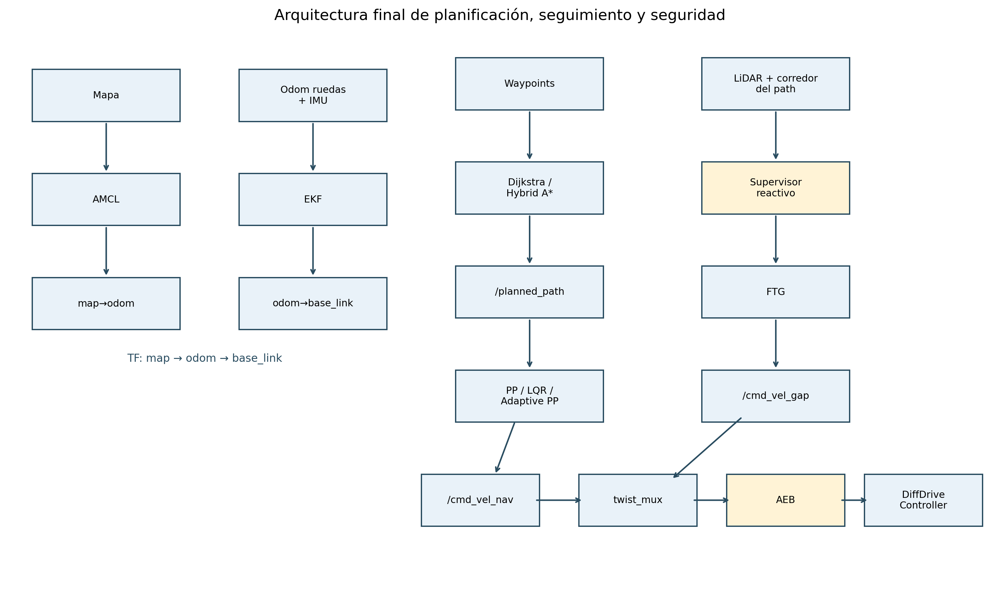
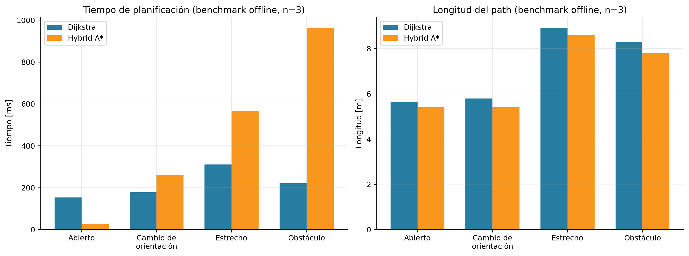
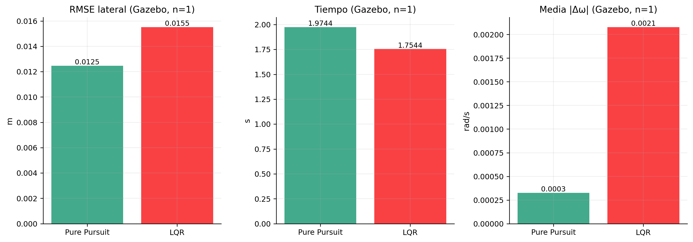
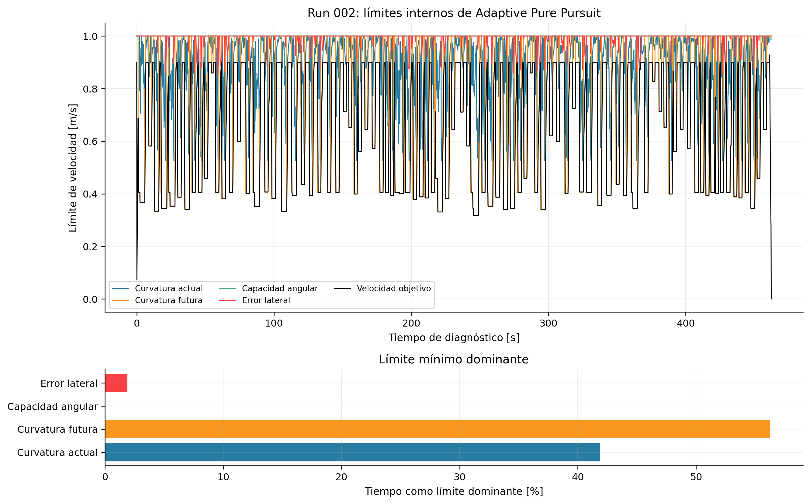
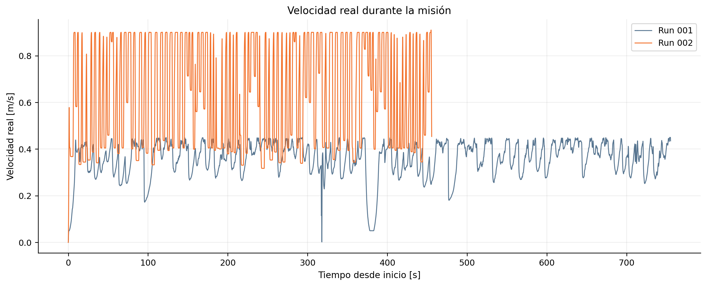
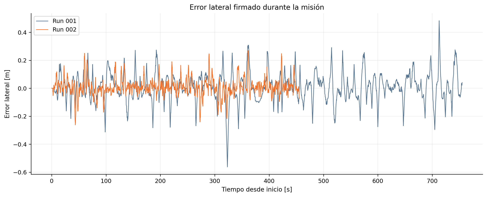
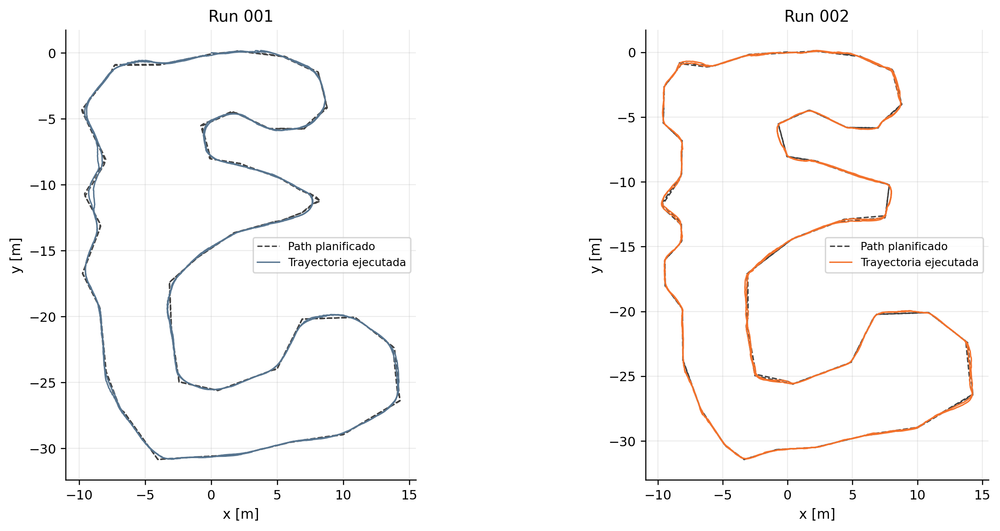
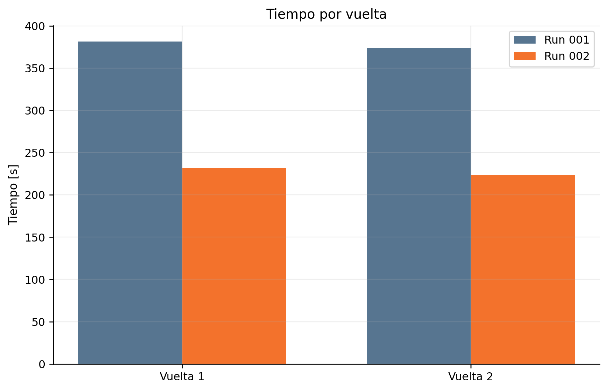
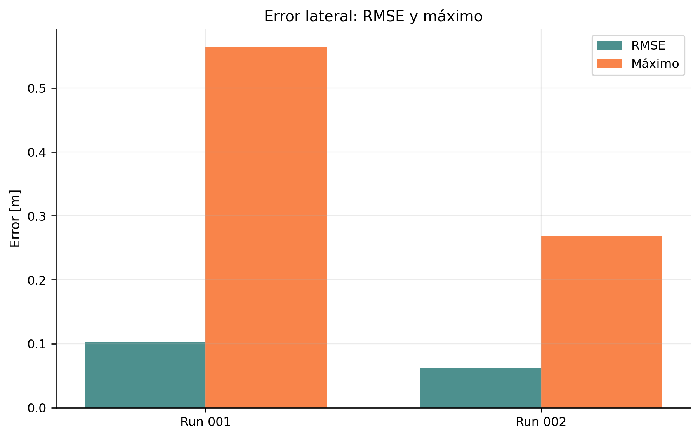
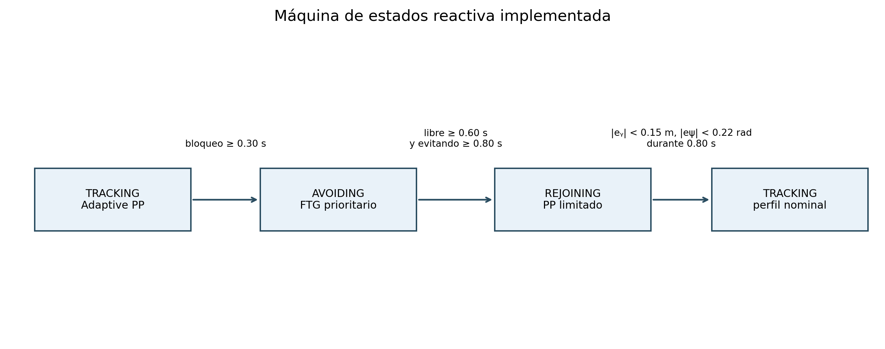

# Análisis científico de Path Planning y Path Tracking

**Desarrollo comparativo y evaluación experimental de planificación global, seguimiento, optimización de velocidad y evasión reactiva para un robot diferencial en ROS 2**

## Resumen

Este documento reconstruye y evalúa el desarrollo del sistema de navegación de un robot móvil diferencial en ROS 2 Jazzy y Gazebo Harmonic. Se auditaron las implementaciones, configuraciones, pruebas, reportes, trazas y rosbags conservados del proyecto. La planificación global compara Dijkstra sobre una grilla de ocupación con Hybrid A* sobre estados discretizados en posición, orientación y sentido; en cuatro escenarios offline ambos alcanzaron 12/12 soluciones, mientras Hybrid A* produjo paths más cortos y error terminal de orientación nulo, aunque no fue siempre el método de menor tiempo de cómputo. El seguimiento compara Pure Pursuit con un LQR formulado para un modelo unicycle diferencial. En el único ensayo controlado equivalente en Gazebo, Pure Pursuit obtuvo 0.012474 m de RMSE lateral frente a 0.015519 m de LQR, mientras LQR terminó 0.220 s antes; la evidencia no permite generalizar este resultado a curvas. A partir de Pure Pursuit se desarrolló Adaptive Pure Pursuit, con lookahead dependiente de velocidad y curvatura futura, límites físicos de rueda y restricciones de aceleración. En dos carreras manuales conservadas de dos vueltas, el tiempo pasó de 755.031 s a 455.640 s y el RMSE lateral de 0.102329 m a 0.062572 m. La reducción temporal end-to-end fue 39.653 %, pero los paths no fueron idénticos. Finalmente se integró Follow The Gap mediante un supervisor TRACKING–AVOIDING–REJOINING, arbitraje `twist_mux` y AEB posterior como capa de seguridad. Las limitaciones y la procedencia de cada resultado se declaran explícitamente.

**Palabras clave:** planificación de trayectorias, Hybrid A*, Pure Pursuit, LQR, robot diferencial, ROS 2, Follow The Gap, evasión reactiva, AEB.

> **Alcance y regla de lectura.** “Medido” identifica un resultado conservado en CSV, reporte, traza o rosbag. “Verificado en código” describe el comportamiento implementado. “Interpretación de ingeniería” es una inferencia razonada y no un ensayo causal. Cuando no existe evidencia suficiente se declara: **Dato no disponible en los experimentos conservados.**

## 1. Introducción

El objetivo técnico fue completar una ruta cerrada de dos vueltas en un entorno hotel, manteniendo localización, seguimiento y seguridad, y posteriormente tolerar obstáculos no incluidos en el mapa. El desarrollo lógico recuperado es:

1. arquitectura inicial de robot diferencial, mapa, LiDAR, odometría y control;
2. establecimiento de `map → odom → base_link` mediante AMCL y EKF;
3. implementación de Dijkstra y Hybrid A*;
4. evaluación controlada de ambos planners;
5. implementación de Pure Pursuit y LQR para unicycle;
6. evaluación offline y en un tramo recto de Gazebo;
7. corrección de TF, finalización prematura, progreso, target y QoS;
8. establecimiento del baseline Pure Pursuit + Hybrid A*;
9. desarrollo de Adaptive Pure Pursuit y diagnóstico de límites de velocidad;
10. aumento del límite físico simulado de ruedas;
11. carreras manuales conservadas de dos vueltas;
12. integración del detector de corredor y Follow The Gap (FTG);
13. corrección de la expansión de *bubble*, rejoin monótono y supervisor;
14. arquitectura final con arbitraje y AEB aguas abajo.

La evidencia primaria está en [planning_core.py](hotel_path_planner/planning_core.py), [tracking_core.py](../hotel_path_tracking/hotel_path_tracking/tracking_core.py), [reactive_core.py](../hotel_ttc_follow_the_gap/hotel_ttc_follow_the_gap/reactive_core.py), los [resultados controlados](../results/ASSIGNMENT_RESULTS_HOTEL.md), los dos directorios bajo [`optimization_results`](../../optimization_results/) y los CSV reproducibles de [`docs/analysis_assets`](docs/analysis_assets/). El script [generate_scientific_analysis.py](docs/analysis_tools/generate_scientific_analysis.py) regenera las figuras y tablas sin publicar topics ni modificar rosbags.

### 1.1 Inventario de fuentes experimentales del workspace

La auditoría se ejecutó desde `/home/lenovo/mrad_ws_2602_hotel`, no únicamente desde `src/`. Se encontraron tres conjuntos que deben mantenerse separados para no combinar ensayos de distinta naturaleza.

#### Tabla I — inventario y jerarquía de evidencia

| Ubicación | Contenido comprobado | Papel en este documento | Criterio de uso |
|---|---|---|---|
| `optimization_results/` | dos runs, dos MCAP, metadata de rosbag, parámetros resueltos, trazas del monitor, perfiles de path, estados iniciales, readiness, ground truth, logs, comparación CSV/Markdown y 12 plots | evidencia principal de la carrera de dos vueltas | fuente primaria para Run 001, Run 002 y Adaptive PP |
| `src/results/` | benchmark offline, sweeps, ensayo controlado Gazebo, reportes, trazas y plots | comparaciones Dijkstra–Hybrid A* y PP–LQR | solo filas explícitamente etiquetadas y ensayos dedicados |
| `results/` en la raíz | 5 planes manuales Hybrid A*, 25 resúmenes manuales/optimization y 317 887 muestras de tracking | evidencia auxiliar de desarrollo | no se usa para inferencia causal porque mezcla paths, intentos y condiciones |
| `src/experiments/` | scripts de benchmark y análisis | reproducibilidad de métricas | explica cómo se produjeron los CSV versionados |
| `src/hotel_esc/bag_file/` | rosbags de identificación ESC | fuera del alcance de path planning/tracking | inventariados, no incorporados a las métricas de navegación |

La carpeta raíz `results/` contiene únicamente Hybrid A* en `planner_results.csv`: tres soluciones y dos fallos por `max_iterations`; por tanto, no puede sustentar por sí sola una comparación Dijkstra–Hybrid A*. Su `tracker_results.csv` mezcla 15 entradas PP, 5 LQR y 5 Adaptive PP con longitudes y paths diferentes. La comparación controlada se toma, en consecuencia, de `src/results/gazebo_*` y de las filas `offline_grid_benchmark`, mientras las carreras provienen exclusivamente de `optimization_results/`.

**Fuente:** inventario `find` desde la raíz; `results/*.csv`; `src/results/*`; `optimization_results/*`; metadata rosbag2 de ambos MCAP.

## 2. Arquitectura del sistema



**Figura 1. Arquitectura final del sistema.** Reconstrucción desde launch, código y YAML. La figura muestra la separación entre localización, referencia global, control nominal, evasión local y seguridad. Su hallazgo principal es que todas las fuentes de velocidad convergen antes del AEB; es un diagrama de arquitectura verificada estáticamente, no una medición temporal. **Fuente:** `hotel_bringup`, `hotel_ekf`, `hotel_path_planner`, `hotel_path_tracking` y `hotel_ttc_follow_the_gap`.

```mermaid
flowchart TD
  M[Mapa] --> A[AMCL] --> MO[map → odom]
  O[Odometría de ruedas + IMU] --> E[EKF] --> OB[odom → base_link]
  W[Waypoints] --> P[Dijkstra / Hybrid A*] --> PATH[/planned_path]
  PATH --> T[Pure Pursuit / LQR / Adaptive PP] --> NAV[/cmd_vel_nav]
  L[LiDAR + corredor futuro del path] --> S[Supervisor reactivo] --> F[Follow The Gap] --> GAP[/cmd_vel_gap]
  NAV --> X[twist_mux]
  GAP --> X
  X --> B[AEB]
  B --> D[DiffDriveController]
```

La separación funcional es deliberada. El planner produce una referencia global estática; el tracker nominal calcula el comando de navegación; el supervisor reactivo decide si esa referencia está bloqueada y, solo en `AVOIDING`, publica el comando FTG de mayor prioridad. `twist_mux` selecciona una fuente y AEB valida siempre el comando seleccionado antes del controlador diferencial.

## 3. Localización, EKF, AMCL y TF

### 3.1 Cadena TF

- AMCL usa `/map` y `/scan`, estima la pose global y publica `map → odom` (`tf_broadcast: true`).
- El EKF propio mantiene el estado `[x, y, yaw, v, omega]`, fusiona el *twist* de `/diffdrive_controller/odom` con `angular_velocity.z` de `/imu`, publica `/ekf/odometry` y es el único propietario de `odom → base_link` a 30 Hz.
- El `diff_drive_controller` conserva su odometría, pero tiene deshabilitada la publicación TF para evitar dos autoridades de `odom → base_link`.
- Planner, path y waypoints se expresan en `map`; trackers y supervisor consultan TF hacia `base_link`.

**Problema → causa → solución → efecto.** En la arquitectura inicial faltaba `odom → base_link` porque el EKF no formaba parte del bringup efectivo. Al añadirlo al launch y dejar AMCL como autoridad exclusiva de `map → odom`, se completó la cadena. A la vez se deshabilitó el TF del controlador diferencial: procesos o fuentes duplicadas habían conservado poses antiguas y producían discontinuidades. Tras consolidar una sola autoridad por transform, planner y tracker pudieron consultar `map → base_link` de forma determinista. Fuentes: [gz_spawn.launch.py](../hotel_bringup/launch/gz_spawn.launch.py), [nav2_params.yaml](../hotel_bringup/config/nav2_params.yaml) y paquete [hotel_ekf](../hotel_ekf/).

### 3.2 Spawn e inicialización

El launch actual define el spawn de Gazebo como:

| Magnitud | Valor actual |
|---|---:|
| `x` | −15.4 m |
| `y` | 0.0 m |
| `z` | 0.5 m |
| `yaw` | 1.57 rad |

El valor fue verificado en [gz_spawn.launch.py](../hotel_bringup/launch/gz_spawn.launch.py). La pose inicial publicada a AMCL representa la pose en el mapa, no las coordenadas mundiales crudas de Gazebo; ambas referencias deben corresponder a la misma ubicación física. Históricamente la ejecución automática empleó un spawn distinto del usado al inicializar AMCL. Esa incoherencia podía desplazar `map → odom`, degradar la correspondencia LiDAR–mapa, presentar obstáculos normales como peligros frontales al AEB y bloquear la navegación. La solución final fue fijar el spawn anterior, iniciar EKF desde bringup y aplicar la inicialización AMCL coherente antes de habilitar la misión.

Los `initial_state.yaml` de ambos runs muestran que, cuando se detectó movimiento, existían `map → odom`, `odom → base_link` y `map → base_link`. Los archivos de *readiness* previos contienen timeouts parciales; por ello no deben confundirse con ausencia de localización durante toda la misión.

| Evidencia al comenzar movimiento | Run 001 | Run 002 |
|---|---:|---:|
| `map→base_link.x` | 0.021724 m | 0.009061 m |
| `map→base_link.y` | −0.005269 m | −0.008134 m |
| `map→base_link.yaw` | −0.026553 rad | −0.010905 rad |
| `odom→base_link` disponible | sí | sí |
| `map→odom` disponible | sí | sí |

En Run 001 el readiness previo no recibió AMCL/map TF antes del timeout; en Run 002 sí recibió AMCL y muestras `map→odom`, pero no cumplió estabilidad `map→base_link`. Los `initial_state.yaml` posteriores demuestran que la cadena estaba completa cuando comenzó la misión. Esta diferencia temporal es una fuente de incertidumbre de arranque, no evidencia de que las vueltas se ejecutaran sin localización. **Fuente:** `optimization_results/run_*/readiness_localized.yaml` e `initial_state.yaml`.

## 4. Path Planning

### 4.1 Dijkstra implementado

La clase de [planning_core.py](hotel_path_planner/planning_core.py) no es una abstracción genérica: opera sobre `nav_msgs/OccupancyGrid` y conserva resolución, origen completo (incluido yaw), ancho y alto. Una celda se considera bloqueada si su ocupación alcanza 65; los valores desconocidos se tratan como obstáculo y se aplica inflación de 0.25 m. El clearance reportado se calcula con una aproximación *chamfer* 8-conectada sobre el mapa no inflado.

- **Estado/nodo:** `(ix, iy)`; la orientación no pertenece al estado.
- **Vecindad:** cuatro u ocho celdas; los experimentos usan 8-conectividad y prohíben cortar esquinas.
- **Costo:** 1 por paso ortogonal y `√2` por diagonal, más un costo de ocupación opcional cuyo peso activo es 0.
- **Colisiones:** la celda debe estar libre después de inflación; un diagonal requiere libres las celdas laterales.
- **Reconstrucción:** mapa de padres desde goal a start y reversión de la secuencia.
- **Orientación de salida:** se deriva del segmento siguiente; la pose final recibe el yaw solicitado, pero este no condiciona la búsqueda.
- **Resolución/salida:** mapa a 0.05 m/celda; el `nav_msgs/Path` final se densifica aproximadamente cada 0.05 m, se publica en `map` con QoS `reliable + transient_local`.

Su costo práctico depende del número de celdas alcanzables. En los cuatro escenarios offline expandió entre 10 563 y 21 639 nodos y empleó entre 153.34 y 310.05 ms. Estos valores medidos son más informativos para este proyecto que una cota asintótica aislada.

### 4.2 Hybrid A* implementado

Hybrid A* utiliza un estado continuo `(x, y, yaw, direction)` y una clave cerrada discretizada `(ix, iy, iθ, direction)`. El valor por defecto de runtime es 0.05 m en XY y 15° en orientación, equivalente a 24 *heading bins*; el benchmark offline de la Tabla A usó 30° (12 bins), dato registrado en cada fila CSV.

- **Primitivas:** integración unicycle de longitud 0.20 m con curvaturas `{−1.6, 0, +1.6}` m⁻¹; el modo actual es solo avance. Se permiten giros in situ porque el robot es diferencial.
- **Costo:** longitud; penalización de giro `0.10·|κ|·Δs`; reversa ×1.4 y cambio de sentido +0.25 cuando se habilitan; giro in situ `0.12·|Δθ|`; costo suave de ocupación con peso activo 0.
- **Heurística:** distancia euclídea al goal, peso 1.0.
- **Colisión:** cada arco se muestrea cada `max(resolución/2, 0.02)` m; con la grilla actual son aproximadamente 0.025 m.
- **Goal:** tolerancias 0.15 m y 20°, con máximo 100 000 iteraciones.
- **Reconstrucción:** padres de estados continuos, pose final exacta y densificación común a 0.05 m.
- **Salida:** `nav_msgs/Path` en `map`, igual interfaz y QoS que Dijkstra.

El planner de waypoints concatena la solución entre pares, elimina la primera pose duplicada de cada segmento y orienta cada waypoint hacia el siguiente. Para una ruta de varias vueltas esto produce un único path largo y cerrado, sobre el que el tracker mantiene progreso monótono.

### 4.3 Metodología de comparación

El benchmark offline reconstruye cuatro problemas sobre el mismo `OccupancyGrid` de 0.05 m/celda: espacio abierto, cambio de orientación, pasillo estrecho y maniobra alrededor de obstáculo. Cada planner ejecutó tres repeticiones con desconocido tratado como obstáculo, inflación 0.25 m y prevención de *corner cutting*. Se registraron éxito, tiempo de planificación, estados expandidos, longitud, poses crudas, clearance *chamfer*, cambios bruscos y error de yaw terminal. El benchmark evalúa al planner aislado; no mide tiempo de seguimiento ni colisión física.

Como verificación adicional se conservó `gazebo_map2_straight_repeated`: tres planes por método desde la misma TF inicial hasta el mismo goal recto. Esta segunda prueba confirma integración ROS/TF, pero no representa una maniobra compleja.

**Fuente:** filas `execution_mode=offline_grid_benchmark` de [`src/results/planner_results.csv`](../results/planner_results.csv), [`src/results/gazebo_planner_results.csv`](../results/gazebo_planner_results.csv), [ASSIGNMENT_RESULTS_HOTEL.md](../results/ASSIGNMENT_RESULTS_HOTEL.md) y scripts bajo [`src/experiments`](../experiments/).

### 4.4 Resultados

#### Tabla II — resultados completos del benchmark offline de planners

| Escenario | Planner | Éxito | Tiempo [ms] | Expandidos | Longitud [m] | Poses | Cambios bruscos | Yaw terminal [rad] | Clearance [m] |
|---|---|---:|---:|---:|---:|---:|---:|---:|---:|
| `open` | Dijkstra | 3/3 | 153.339 | 10 563 | 5.649 | 109 | 1 | 0.785 | 0.595 |
| `open` | Hybrid A* | 3/3 | 27.370 | 1 037 | 5.398 | 31 | 0 | 0.000 | 0.595 |
| `orientation_change` | Dijkstra | 3/3 | 176.902 | 11 966 | 5.794 | 97 | 1 | 2.356 | 0.400 |
| `orientation_change` | Hybrid A* | 3/3 | 259.570 | 9 584 | 5.399 | 32 | 1 | 0.000 | 0.400 |
| `narrow` | Dijkstra | 3/3 | 310.053 | 21 639 | 8.926 | 170 | 7 | 2.356 | 0.283 |
| `narrow` | Hybrid A* | 3/3 | 565.621 | 20 428 | 8.597 | 52 | 1 | 0.000 | 0.262 |
| `obstacle_manoeuvre` | Dijkstra | 3/3 | 220.443 | 14 910 | 8.294 | 147 | 19 | 0.785 | 0.283 |
| `obstacle_manoeuvre` | Hybrid A* | 3/3 | 964.185 | 34 842 | 7.797 | 42 | 1 | 0.000 | 0.262 |

Los valores de tiempo son medias de tres repeticiones; las demás métricas fueron deterministas en esas repeticiones. La correspondencia correcta para `obstacle_manoeuvre` es Dijkstra = 8.294 m y 220.443 ms; Hybrid A* = 7.797 m y 964.185 ms. Es decir, Hybrid produjo la referencia más corta pero requirió 4.37 veces el tiempo de planificación.

**Fuente de la Tabla II:** `src/results/planner_results.csv`; agregación reproducible en [planner_comparison.csv](docs/analysis_assets/planner_comparison.csv). El clearance es una aproximación 8-conectada y no una distancia euclídea exacta.



**Figura 2. Tiempo y longitud por escenario.** Las barras usan exactamente las 24 filas offline de la Tabla II. Hybrid A* fue simultáneamente más rápido y corto solo en `open`; en los escenarios restantes intercambió menor longitud por mayor cómputo. La figura no incluye ejecución física del path ni permite inferir seguridad a partir del clearance aproximado. **Fuente:** `src/results/planner_results.csv`.

#### Tabla III — síntesis Dijkstra frente a Hybrid A*

| Métrica | Dijkstra | Hybrid A* | Observación |
|---|---:|---:|---|
| Éxito offline total | 12/12 | 12/12 | Ambos resolvieron los cuatro escenarios. |
| Tiempo `open` | 153.34 ms | 27.37 ms | La heurística orientó bien la búsqueda abierta. |
| Longitud `open` | 5.649 m | 5.398 m | Hybrid redujo 0.250 m. |
| Tiempo `orientation_change` | 176.90 ms | 259.57 ms | Incluir orientación aumentó el espacio de búsqueda. |
| Longitud `orientation_change` | 5.794 m | 5.399 m | Hybrid satisfizo además yaw final. |
| Tiempo `narrow` | 310.05 ms | 565.62 ms | Dijkstra fue menos costoso en este pasillo. |
| Longitud `narrow` | 8.926 m | 8.597 m | Hybrid fue 0.329 m más corto. |
| Tiempo `obstacle_manoeuvre` | 220.44 ms | 964.18 ms | Hybrid expandió 34 842 estados frente a 14 910. |
| Longitud `obstacle_manoeuvre` | 8.294 m | 7.797 m | Menor longitud con mayor costo de búsqueda. |
| Error yaw terminal, cuatro casos | 2.356/0.785/0.785/2.356 rad | 0 en todos | Dijkstra no busca en orientación. |
| Cambios bruscos `obstacle_manoeuvre` | 19 | 1 | Métrica geométrica del CSV antes de densificación. |
| Poses crudas `obstacle_manoeuvre` | 147 | 42 | La densificación posterior iguala resolución de consumo. |
| Clearance `open` | 0.595 m | 0.595 m | Aproximación *chamfer*, no medición física. |
| Clearance `narrow` | 0.283 m | 0.262 m | No sustenta declarar un ganador en seguridad. |
| Gazebo recto, tiempo | 16.881 ± 0.637 ms | 0.706 ± 0.108 ms | n=3; caso abierto y corto, no extrapolable. |
| Gazebo recto, longitud | 0.950 m | 1.000 m | Dijkstra fue 0.050 m más corto en ese caso. |
| Ruta cerrada completa con Dijkstra | Dato no disponible | Run 001 y 002 completados | No existe rosbag de dos vueltas Dijkstra equivalente. |
| Curvatura/clearance euclídeo exacto | Dato no disponible | Dato no disponible | Solo cambios angulares y clearance aproximado fueron conservados. |

**Fuente de la Tabla III:** Tabla II y ensayo `gazebo_map2_straight_repeated` de `src/results/gazebo_planner_results.csv`.

### 4.5 Discusión

El resultado no admite la narrativa “Hybrid A* siempre es mejor”. Dijkstra explora una grilla bidimensional de menor cardinalidad y fue 1.82 veces más rápido en `narrow` y 4.37 veces más rápido en `obstacle_manoeuvre`. Hybrid A* incorpora orientación y primitivas, lo que elevó el costo de búsqueda, pero redujo la longitud entre 4.4 % y 8.0 % según el escenario y eliminó el error terminal de yaw. En `open`, la heurística euclídea fue especialmente informativa y Hybrid expandió cerca de una décima parte de los estados de Dijkstra.

Los cambios bruscos son una aproximación discreta a suavidad: 19 frente a 1 en `obstacle_manoeuvre` sí indica una referencia angularmente menos fragmentada, pero no sustituye una integral de curvatura. El tracker consume el path densificado, de modo que el menor número de poses crudas de Hybrid no implica una tasa de control menor; implica que la geometría previa a densificación se construyó con arcos más largos y orientación explícita.

### 4.6 Selección de Hybrid A*

**Hechos experimentales.** En los cuatro escenarios offline Hybrid A* terminó con error de yaw nulo y produjo paths entre 0.250 y 0.497 m más cortos. En la maniobra con obstáculo registró un cambio brusco frente a 19 de Dijkstra. Los dos runs completos conservados emplearon Hybrid A* y llegaron a dos vueltas. A la vez, Hybrid A* fue más lento que Dijkstra en tres de los cuatro escenarios offline; por tanto, no se seleccionó por una supuesta superioridad universal de tiempo.

**Interpretación de ingeniería.** La orientación dentro del estado y los arcos unicycle generan una referencia con continuidad de heading más conveniente para un tracker a velocidad. Para el robot diferencial, los giros in situ son físicamente compatibles y permiten satisfacer orientaciones sin convertir cada cambio de celda en una corrección brusca. Esta combinación justificó Hybrid A* para la carrera. Falta un experimento de dos vueltas, con los mismos waypoints y tracker, que aísle causalmente el efecto del planner.

## 5. Path Tracking

### 5.1 Pure Pursuit implementado

Pure Pursuit recibe el path con QoS transiente, valida frame y valores finitos y consulta la pose en TF. Su implementación real incluye:

1. `closest_index`: busca desde el último índice y limita el salto futuro a 1.5 m de arco; nunca retrocede;
2. target: primer punto posterior cuya distancia euclídea desde la pose alcanza el lookahead;
3. transformación al frame del robot; si `x_body ≤ 0`, ordena `v=0` y gira para recuperar un target frontal;
4. curvatura `κ = clamp(2 y_body/(L_d²+ε), −κ_max, κ_max)`;
5. velocidad nominal reducida por distancia al goal y error transversal al target;
6. `ω = vκ`, saturada y filtrada `ω_k = 0.5ω_limitada + 0.5ω_{k−1}`;
7. aproximación final mediante estabilizador unicycle y alineación al yaw final.

El lookahead estándar es:

$$L_d=\operatorname{clamp}(0.60+1.30|v_{initial}|,\ 0.30,\ 1.20)\;\mathrm{m}.$$

La meta solo puede aceptarse cuando el índice ha superado 95 % del path. Esto evita que una ruta cerrada termine al pasar por la geometría del goal al final de la primera vuelta.

### 5.2 LQR implementado

No es un LQR Ackermann. El error real menos referencia se expresa en el frame de la referencia: $e=[e_x,e_y,e_\theta]^T$, y la entrada incremental es $\delta u=[v-v_r,\omega-\omega_r]^T$. La linealización unicycle implementada es:

$$
\dot e_x=\omega_r e_y+\delta v,\qquad
\dot e_y=-\omega_r e_x+v_r e_\theta,\qquad
\dot e_\theta=\delta\omega.
$$

Se discretiza por Euler con el periodo de control, se resuelve iterativamente la ecuación algebraica de Riccati discreta y se aplica $\delta u=-Ke$. Las matrices activas son $Q=\operatorname{diag}(1,6,3)$ y $R=\operatorname{diag}(0.8,0.6)$. La referencia usa lookahead fijo de 0.25 m, `v_r` decrece cerca del goal y `ω_r=v_rκ_r`; el resultado se satura a límites lineales y angulares. Comparte con Pure Pursuit las protecciones de progreso, target detrás y finalización.

### 5.3 Metodología

La comparación tuvo dos niveles. Primero se usó simulación cinemática offline con el mismo path Dijkstra, modelo unicycle, límites comunes y perturbación inicial de 0.10 m lateral y 0.10 rad. Después se ejecutó un ensayo controlado corto en Gazebo: mismo path Dijkstra recto, mismo goal, reinicio limpio de Gazebo/EKF/AMCL y una repetición por tracker. La primera etapa permite observar tendencias bajo modelo ideal; la segunda incluye TF, localización y dinámica simulada, pero carece de tamaño muestral y curvas.

Las métricas fueron RMSE/MAE/máximo de CTE, RMSE angular, tiempo, error final, progreso, saturaciones, variación media `abs(Δω)` y costo de cómputo offline. La traza LQR original contenía muestras de stop posteriores al cierre; el análisis Gazebo usa solo las 36 muestras delimitadas por su resumen, frente a 39 de PP.

**Fuente:** [`src/results/tracker_results.csv`](../results/tracker_results.csv), [`src/results/gazebo_tracker_results.csv`](../results/gazebo_tracker_results.csv), [`gazebo_tracker_trace.csv`](../results/gazebo_tracker_trace.csv) y scripts `src/experiments/analyze_*`.

### 5.4 Resultados

#### Tabla IV — comparación cinemática offline

| Escenario | Tracker | Éxito | RMSE CTE [m] | CTE máx. [m] | Tiempo [s] | Error goal [m] | `abs(Δω)` [rad/s] | Cómputo [μs] |
|---|---|---:|---:|---:|---:|---:|---:|---:|
| `straight_open` | Pure Pursuit | 6/6 | 0.272 | 0.866 | 13.40 | 0.238 | 0.0015 | 7.5 |
| `straight_open` | LQR | 6/6 | 0.057 | 0.204 | 10.72 | 0.237 | 0.0191 | 2 785.0 |
| `curves_orientation` | Pure Pursuit | 3/3 | 0.245 | 0.804 | 14.32 | 0.243 | 0.0014 | 6.9 |
| `curves_orientation` | LQR | 3/3 | 0.056 | 0.199 | 11.00 | 0.242 | 0.0188 | 2 806.4 |
| `narrow` | Pure Pursuit | 6/6 | 0.358 | 0.862 | 25.92 | 0.243 | 0.0018 | 13.0 |
| `narrow` | LQR | 6/6 | 0.065 | 0.213 | 17.36 | 0.237 | 0.0496 | 2 783.9 |
| `curves_obstacle` | Pure Pursuit | 0/6 | 0.458 | 0.666 | 5.08 | 5.500 | 0.0030 | 16.5 |
| `curves_obstacle` | LQR | 0/6 | 0.153 | 0.223 | 3.76 | 5.437 | 0.3171 | 2 800.0 |

En los tres escenarios exitosos, LQR redujo el error en el modelo ideal, pero empleó aproximadamente 2.8 ms por ciclo y produjo variaciones angulares mayores. En `curves_obstacle` ambos colisionaron con el mapa inflado: los errores allí describen solo la trayectoria previa al fallo y no una solución válida.

**Fuente de la Tabla IV:** filas `offline_kinematic_simulation` de `src/results/tracker_results.csv` y `ASSIGNMENT_RESULTS_HOTEL.md`.

#### Tabla V — ensayo controlado Gazebo, path recto



**Figura 3. Comparación controlada de trackers.** Resume RMSE, tiempo y variación angular del único ensayo Gazebo recto. PP presentó menor RMSE y comando más suave; LQR terminó antes. La figura no contiene barras de dispersión porque `n=1`, por lo que no representa una distribución estadística. **Fuente:** `src/results/gazebo_tracker_results.csv`.

| Métrica | Pure Pursuit | LQR | Observación |
|---|---:|---:|---|
| Éxito / progreso | 1/1; 100 % | 1/1; 100 % | Ambos llegaron a tolerancia. |
| Tiempo | 1.974357 s | 1.754421 s | LQR terminó 0.219936 s antes. |
| RMSE lateral | 0.012474 m | 0.015519 m | PP fue 19.6 % menor en este único tramo. |
| Error lateral máximo | 0.019694 m | 0.020000 m | Diferencia 0.000306 m. |
| RMSE heading | 0.012615 rad | 0.015160 rad | Solo trayectoria recta. |
| Error final al goal | 0.260178 m | 0.236504 m | LQR finalizó 0.023674 m más cerca. |
| Media `abs(Δω)` | 0.000326 rad/s | 0.002078 rad/s | PP produjo variación angular 6.4× menor. |
| Saturaciones de `ω` | 0 | 0 | Ambos a ≈20 Hz. |
| Velocidad media/máxima real | Dato no disponible | Dato no disponible | No fue resumida de forma comparable en este ensayo. |
| Vuelta completa equivalente | Dato no disponible | Dato no disponible | No existe rosbag completo LQR equivalente. |
| Número de fallos en curvas Gazebo | Dato no disponible | Dato no disponible | Curvas no se probaron con reinicios controlados. |

**Fuente de la Tabla V:** [GAZEBO_CLOSED_LOOP_RESULTS_HOTEL.md](../results/GAZEBO_CLOSED_LOOP_RESULTS_HOTEL.md), [gazebo_tracker_results.csv](../results/gazebo_tracker_results.csv) y [tracker_comparison.csv](docs/analysis_assets/tracker_comparison.csv).

### 5.5 Discusión

La simulación cinemática favoreció a LQR en error y tiempo, mientras el único ensayo Gazebo mostró 19.6 % menor RMSE para PP y 6.4 veces menor variación angular. La inversión es coherente con una dependencia mayor del LQR respecto al modelo y la referencia local. No constituye evidencia suficiente para afirmar que PP sea superior en curvas, ni que LQR sea inferior bajo otra sintonización.

El costo LQR offline de aproximadamente 2.8 ms ocupa 5.6 % de un periodo de 50 ms y ambos controladores mantuvieron ≈20 Hz en Gazebo; por tanto, el costo no fue un incumplimiento de tiempo real. La diferencia práctica fue la trazabilidad y suavidad: PP expone directamente lookahead, curvatura y target, variables que pudieron transformarse en límites adaptativos interpretables.

### 5.6 Selección de Pure Pursuit

**Hechos experimentales.** En el ensayo real de Gazebo conservado, Pure Pursuit obtuvo menor RMSE lateral y menor variación angular que LQR; ambos fueron funcionales. LQR fue más rápido y acabó más cerca del goal. No existe comparación de vueltas completas.

**Interpretación de ingeniería.** Pure Pursuit ofrecía una ley geométrica simple, estable y trazable, con bajo costo de cómputo y variables que podían convertirse directamente en lookahead, preview y velocidad adaptativos. Se continuó con él por conveniencia para este sistema y por su extensibilidad hacia Adaptive Pure Pursuit, no porque sea universalmente superior a LQR.

## 6. Correcciones del sistema de tracking

| Problema | Causa | Acción correctiva | Efecto verificado/esperado |
|---|---|---|---|
| TF incompleto | EKF ausente del bringup | iniciar EKF y asignarle `odom → base_link` | cadena global resoluble por planner/tracker |
| TF doble | controlador y/o procesos huérfanos publicaban odometría TF | `publish_tf=false`, una sola instancia EKF | elimina saltos y poses antiguas |
| Goal prematuro en ruta cerrada | la primera vuelta pasa cerca del goal final | exigir progreso ≥95 % además de distancia | no termina al completar solo una vuelta |
| Salto a otra rama/vuelta | búsqueda global del punto más cercano en geometría solapada | índice mínimo monótono y ventana futura de 1.5 m | preserva orden topológico del path |
| Target detrás | una referencia pasada generaba avance incorrecto | `v=0` y giro de recuperación | reacquisición frontal antes de avanzar |
| Tracker no recibía un path ya publicado | QoS volátil en un publisher de una sola emisión | `reliable + transient_local` | suscriptores tardíos reciben `/planned_path` |
| Referencia demasiado dispersa | waypoints/primitivas separados | densificación ≈0.05 m | lookahead e índices con muestreo uniforme |
| Errores de frame/datos | path vacío, frame distinto o números no finitos | validación explícita y TF con timeout | fallo seguro en vez de comando inválido |
| Orbitado cerca del goal | círculo de Pure Pursuit tangente al final | estabilizador unicycle terminal | convergencia de posición y luego yaw |
| Rejoin a un tramo anterior | proximidad geométrica sin topología | `rejoin_index=max(last,closest,candidate)` | reingreso monótono al recorrido pendiente |

Estas correcciones están cubiertas por [test_tracking_core.py](../hotel_path_tracking/test/test_tracking_core.py) y por las validaciones de Gazebo documentadas; no corresponden a cambios introducidos para este documento.

## 7. Desarrollo del Adaptive Pure Pursuit

### 7.1 Motivación y ley de lookahead

El PP estándar fijaba su perfil de velocidad con una dependencia limitada de la geometría inmediata. Para elevar la velocidad sin llegar tarde a una curva se incorporó preview de curvatura, errores de seguimiento, capacidad angular, ruedas y *rate limiters*. La ley activa, verificada en [adaptive_pure_pursuit.yaml](../hotel_path_tracking/config/adaptive_pure_pursuit.yaml), es:

$$
L_d=\operatorname{clamp}\!\left(
\frac{L_{base}+k_v|v_{prev}|}{1+k_{Ld}|\kappa_{preview}|},
L_{min},L_{max}\right),
$$

con $L_{base}=0.60$ m, $k_v=0.60$ s, $k_{Ld}=0.60$ m, $L_{min}=0.30$ m y $L_{max}=1.20$ m. $|\kappa_{preview}|$ es el máximo valor absoluto de la curvatura de referencia dentro de los siguientes 1.20 m de arco. El lookahead crece con la velocidad, pero se acorta ante curvatura futura.

### 7.2 Planificador local de velocidad

La velocidad objetivo es el mínimo entre:

$$
\begin{aligned}
v_\kappa &= \frac{v_{max}}{1+k_\kappa|\kappa|}, &
v_{preview} &= \frac{v_{max}}{1+k_\kappa|\kappa_{preview}|},\\
v_\omega &= \min\left(v_{max},\frac{\omega_{max}}{|\kappa|}\right), &
v_e &= \frac{v_{max}}{1+k_e\max(0,|e_y|-e_{y0})},\\
v_\psi &= \frac{v_{max}}{1+k_\psi\max(0,|e_\psi|-e_{\psi0})}, &
v_{wheel} &= \frac{r\omega_{wheel,max}}{1+\frac{b}{2}|\kappa|}.
\end{aligned}
$$

Por tanto,

$$v_{target}=\min(v_{nom},v_{max},v_\kappa,v_{preview},v_\omega,v_e,v_\psi,v_{wheel}).$$

Los umbrales activos son $e_{y0}=0.12$ m y $e_{\psi0}=0.17$ rad, con ganancias 1.00 y 0.35. También se impone el límite conjunto $|v|+b|\omega|/2\le r\omega_{wheel,max}$, que representa simultáneamente ambas ruedas y no solo el movimiento recto. Finalmente, un *rate limiter* aplica aceleración 0.70 m/s², desaceleración 1.40 m/s² y aceleración angular 5.00 rad/s². Esta secuencia evita que una consigna geométricamente válida exceda la capacidad de rueda o cambie instantáneamente.

**Fuente:** [tracking_core.py](../hotel_path_tracking/hotel_path_tracking/tracking_core.py), [adaptive_pure_pursuit_node.py](../hotel_path_tracking/hotel_path_tracking/adaptive_pure_pursuit_node.py) y parámetros resueltos de Run 002.

## 8. Optimización física de velocidad

### 8.1 Cambio de interfaz de rueda

En [ros2_control.xacro](../hotel_description/diffdrive_urdf/ros2_control.xacro) los límites de cada rueda cambiaron históricamente de ±10 a ±20 rad/s. Con radio $r≈0.05$ m:

$$v_{max}=r\omega_{wheel,max}:\quad 0.05\cdot10=0.50\;\mathrm{m/s}\ \longrightarrow\ 0.05\cdot20=1.00\;\mathrm{m/s}.$$

Como parte de este cambio físico/configurado **no se modificaron masa, torque, fricción, lógica/umbrales AEB, EKF ni AMCL**. El AEB recibió publicadores de telemetría en la evolución del proyecto, pero su decisión de seguridad no se relajó. Es un aumento de la velocidad angular permitida por la interfaz simulada; no representa un cambio de motor ni una validación de torque disponible.

#### Tabla VI — parámetros principales antes y después de la optimización

| Parámetro | PP estándar / Run 001 | Adaptive PP / Run 002 | Función |
|---|---:|---:|---|
| Frecuencia | 25 Hz | 25 Hz | periodo de control |
| Velocidad nominal | 0.45 m/s | 0.90 m/s | consigna en recta |
| Velocidad máxima | 0.50 m/s | 1.00 m/s | techo lineal |
| Velocidad angular máxima | 2.00 rad/s | 4.00 rad/s | techo de giro |
| Curvatura máxima | 1.60 m⁻¹ | 2.00 m⁻¹ | saturación geométrica |
| Lookahead | `clamp(0.60+1.30 abs(v),0.30,1.20)` | ley con `v_prev` y `κ_preview` | selección de target |
| Preview de curvatura | no explícito | 1.20 m | anticipación de curvas |
| Aceleración / desaceleración | no explícitas | 0.70 / 1.40 m/s² | limitación temporal |
| Aceleración angular | no explícita | 5.00 rad/s² | suavizado angular |
| Límite de rueda | 10 rad/s | 20 rad/s | capacidad física simulada |

**Fuente de la Tabla VI:** `optimization_results/run_001.../parameters.yaml`, `run_002.../resolved_controller_parameters.yaml`, [adaptive_pure_pursuit.yaml](../hotel_path_tracking/config/adaptive_pure_pursuit.yaml) y [main_parameters.csv](docs/analysis_assets/main_parameters.csv).

### 8.2 Límites dominantes medidos



**Figura 4. Límites internos de Adaptive Pure Pursuit.** La serie superior contiene los cuatro techos `Float32` nativos y la velocidad objetivo; la barra inferior integra el tiempo durante el que cada techo fue el mínimo. El preview domina antes de muchas curvas y la curvatura actual durante la maniobra; error lateral y omega rara vez son el mínimo. La figura cubre un solo run y no aísla el efecto de cada término. **Fuente:** topics `/path_tracking/speed_limit_*` del MCAP Run 002.

#### Tabla VII — dominancia de límites de velocidad en Run 002

| Límite | Tiempo dominante [s] | Fracción [%] | Interpretación |
|---|---:|---:|---|
| curvatura futura / preview | 259.974 | 56.234 | anticipación de geometría próxima |
| curvatura actual | 193.580 | 41.872 | maniobra presente |
| error lateral | 8.706 | 1.883 | reducción por desviación acumulada |
| capacidad angular | 0.051 | 0.011 | rara vez fue el cuello de botella |

Los diagnósticos se extrajeron directamente del MCAP con el mismo algoritmo de empates de [compare_run001_vs_run002.py](../hotel_path_tracking/hotel_path_tracking/compare_run001_vs_run002.py). Fuente estructurada: [adaptive_limit_dominance.csv](docs/analysis_assets/adaptive_limit_dominance.csv); serie nativa alineada: [adaptive_limits.csv](docs/analysis_assets/adaptive_limits.csv).

## 9. Metodología de carrera

### 9.1 Relación con los benchmarks previos

Los planners se ejecutaron tres veces por escenario sobre la misma grilla a 0.05 m, con desconocido como obstáculo e inflación 0.25 m. Los trackers se evaluaron primero con simulación cinemática unicycle y la misma perturbación inicial, y después una vez por controlador sobre un path Dijkstra recto en Gazebo. Las métricas fueron longitud, estados, tiempo, clearance aproximado, yaw terminal, CTE, heading, tiempo, progreso y variación angular.

### 9.2 Experimentos en Gazebo y análisis de rosbags

Las carreras fueron observaciones manuales pasivas, no ejecuciones creadas durante este análisis. El monitor [optimization_monitor.py](../hotel_path_tracking/hotel_path_tracking/optimization_monitor.py) esperaba un path repetido para dos vueltas, proyectaba `map → base_link` sobre la polilínea en una ventana de progreso y forzaba $s_k\ge s_{k-1}$. Cada vuelta se detectaba en el arco $s=L\,n/2$: era necesario superar 95 % del arco correspondiente y estar dentro del radio del punto de cierre. La terminación requería dos vueltas, proximidad final, progreso final y un tiempo de permanencia.

El tiempo de misión comienza cuando `|v_nav|` o la velocidad EKF supera el umbral; por eso es menor que la duración total del bag, que incluye preparación y cierre. El RMSE lateral es $\sqrt{N^{-1}\sum e_y^2}$ sobre las muestras del monitor. La distancia se integra entre poses TF sucesivas. AEB permaneció habilitado y se registraron `/aeb/active`, TTC, distancia crítica y bloqueo del comando.

Los bags contienen path, TF, LiDAR, IMU, odometría cruda/EKF, comandos antes y después de arbitraje, AMCL, AEB y diagnósticos del tracker. La ejecución automática añadía *readiness*, publicación de pose y captura de estado; las dos carreras finales se etiquetan como manuales en metadata.

El modo de captura fue `passive_manual_observation`: el recorder no publicó comandos, no reinició Gazebo y no alteró parámetros. `commands.yaml` conserva la invocación exacta del monitor y de `ros2 bag record`; `metadata.yaml` conserva hashes de mundo, mapa, waypoints, launch y nodos; `resolved_controller_parameters.yaml` es el dump efectivo del tracker; `initial_state.yaml` captura EKF, AMCL y las tres transforms cuando comenzó el movimiento; `readiness_localized.yaml` registra el estado previo; `gazebo_ground_truth.yaml` conserva una consulta al servicio y su fallback de topic; `monitor_trace.csv` contiene la serie a 25 Hz; `path_profile.csv` contiene la referencia por arco; `results.yaml` contiene el resumen final.

La consulta directa al servicio de pose Gazebo agotó el timeout, pero el fallback `/world/empty_world/pose/info` sí quedó archivado. Las métricas de carrera no usan ese fallback como ground truth: usan TF/AMCL y `/ekf/odometry`. Esto evita presentar una pose de Gazebo no sincronizada como error de tracking, pero deja como limitación la ausencia de una comparación sistemática contra ground truth.

### 9.3 Inventario de rosbags analizados

#### Tabla VIII — tamaño, duración y contenido global de los bags

| Run | MCAP | Tamaño | Duración bag | Mensajes | Topics | Misión |
|---|---|---:|---:|---:|---:|---|
| `run_001_original_speed_baseline` | `original_speed_baseline_0.mcap` | 10.200 GB (9.50 GiB) | 947.083 s | 821 470 | 35 | 2 vueltas, PP estándar + Hybrid A* |
| `run_002_adaptive_double_speed` | `adaptive_double_speed_0.mcap` | 4.727 GB (4.40 GiB) | 557.498 s | 515 507 | 39 | 2 vueltas, Adaptive PP + Hybrid A* |

Run 001 fue creado el 2026-09-14 22:31:33 UTC y Run 002 el 2026-09-15 03:41:35 UTC según sus metadata. `/planned_path` aparece una vez en cada bag; Run 001 conserva 9 325 scans y 27 974 mensajes EKF, Run 002 5 498 scans y 16 491 mensajes EKF. El bag de Run 001 dura 192.052 s más que la misión medida; el de Run 002, 101.858 s más. Esa diferencia corresponde a preparación/cierre y demuestra por qué duración de MCAP y tiempo de carrera no son intercambiables.

**Fuente de la Tabla VIII:** `optimization_results/run_*/rosbag/*/metadata.yaml` y tamaño de los MCAP en disco; tiempo de misión en cada `results.yaml`.

### 9.4 Advertencia metodológica esencial

Los experimentos **no usaron el mismo path**. La metadata de Run 001 identifica el YAML histórico de 40 waypoints; su path densificado contiene 6 501 poses y mide 276.388069 m. Run 002 usa 46 waypoints, 6 792 poses y 281.792330 m. Las firmas SHA-256 de configuración corresponden respectivamente a la revisión histórica y a la configuración actual. La diferencia geométrica fue verificada por [comparison_run001_vs_run002.md](../../optimization_results/comparison_run001_vs_run002.md).

En consecuencia, la reducción de 39.653 % es un resultado **end-to-end de dos configuraciones experimentales**, no el efecto causal aislado de Adaptive Pure Pursuit. Esta limitación afecta metodología, resultados y discusión.

## 10. Resultados de rosbags

### 10.1 Run 001 — `run_001_original_speed_baseline`

Run 001 es el baseline original: Hybrid A*, misión de waypoints fijos, Pure Pursuit estándar, dos vueltas, simulación Gazebo y AEB habilitado. La metadata clasifica la captura como observación manual pasiva. El monitor trabajó a 25 Hz, con límite de rueda 10 rad/s y techo lineal derivado de 0.50 m/s. El MCAP dura 947.083 s, mientras la misión efectiva desde movimiento hasta finalización dura 755.031 s.

#### Tabla IX — métricas verificadas de Run 001

| Grupo | Métrica | Valor | Procedencia exacta |
|---|---|---:|---|
| misión | finalización | 2/2 vueltas, `two_laps_complete` | `results.yaml/result` |
| tiempo | misión efectiva | 755.031 s | `results.yaml/result/total_time_s` |
| tiempo | vuelta 1 / vuelta 2 | 381.351 / 373.640 s | `results.yaml/result/lap_1, lap_2` |
| velocidad | media muestreada | 0.359733 m/s | media de `actual_v_m_s` en `monitor_trace.csv` |
| velocidad | distancia/tiempo | 0.360468 m/s | `results.yaml/result/average_velocity_m_s` |
| velocidad | máxima real | 0.450358 m/s | `/ekf/odometry`, resumido en `results.yaml` |
| comando | media / máximo | 0.360244 / 0.450000 m/s | `comparison_run001_vs_run002.csv` |
| giro | media / máximo de velocidad angular real | 0.076258 / 0.668598 rad/s | `results.yaml` |
| tracking | RMSE lateral | 0.102329 m | proyección TF–path del monitor |
| tracking | error lateral máximo | 0.563961 m | `results.yaml` |
| tracking | progreso final | 99.867960 % | arco monótono del monitor |
| recorrido | distancia integrada | 272.164149 m | poses TF sucesivas |
| seguridad | AEB | 1 evento; 0.760 s | `/aeb/active` y `/aeb/command_blocked` |
| seguridad | clearance frontal mínimo | 0.510239 m | sector LiDAR frontal `[-20°, +20°]` |
| referencia | path | 6 501 poses; 276.388069 m; 40 waypoints | `/planned_path`, `path_profile.csv`, hash metadata |
| rosbag | duración / tamaño / mensajes | 947.083 s / 10.200 GB / 821 470 | metadata rosbag2 + MCAP |

La primera vuelta tuvo velocidad media 0.355953 m/s, RMSE 0.103894 m y error máximo 0.563961 m. La segunda aumentó a 0.363590 m/s, con RMSE 0.100706 m y máximo 0.487073 m. El único evento AEB se concentró alrededor del 41.479–43.479 % de progreso.

**Fuente primaria:** [`optimization_results/run_001_original_speed_baseline/results.yaml`](../../optimization_results/run_001_original_speed_baseline/results.yaml), [`monitor_trace.csv`](../../optimization_results/run_001_original_speed_baseline/monitor_trace.csv), [`path_profile.csv`](../../optimization_results/run_001_original_speed_baseline/path_profile.csv), [`metadata.yaml`](../../optimization_results/run_001_original_speed_baseline/metadata.yaml) y metadata del rosbag.

### 10.2 Run 002 — `run_002_adaptive_double_speed`

Run 002 conserva Hybrid A* pero usa Adaptive Pure Pursuit, límite de rueda 20 rad/s, velocidad nominal 0.90 m/s y máxima 1.00 m/s. También es una observación manual pasiva de dos vueltas con AEB habilitado. Su MCAP dura 557.498 s; la misión efectiva dura 455.640 s. Los cuatro topics internos de límites permiten reconstruir qué restricción gobernó la velocidad en cada ciclo.

#### Tabla X — métricas verificadas de Run 002

| Grupo | Métrica | Valor | Procedencia exacta |
|---|---|---:|---|
| misión | finalización | 2/2 vueltas, `two_laps_complete` | `results.yaml/result` |
| tiempo | misión efectiva | 455.640 s | `results.yaml/result/total_time_s` |
| tiempo | vuelta 1 / vuelta 2 | 231.800 / 223.800 s | `results.yaml/result/lap_1, lap_2` |
| velocidad | media muestreada | 0.621663 m/s | media de `actual_v_m_s` en `monitor_trace.csv` |
| velocidad | distancia/tiempo | 0.622873 m/s | `results.yaml/result/average_velocity_m_s` |
| velocidad | máxima real | 0.909953 m/s | `/ekf/odometry`, resumido en `results.yaml` |
| comando | media / máximo | 0.621870 / 0.956000 m/s | `comparison_run001_vs_run002.csv` |
| giro | media / máximo de velocidad angular real | 0.206174 / 1.058840 rad/s | `results.yaml` |
| tracking | RMSE lateral | 0.062572 m | proyección TF–path del monitor |
| tracking | error lateral máximo | 0.268772 m | `results.yaml` |
| tracking | progreso final | 99.901664 % | arco monótono del monitor |
| recorrido | distancia integrada | 283.805924 m | poses TF sucesivas |
| seguridad | AEB | 0 eventos; 0 s | diagnósticos `/aeb/*` |
| seguridad | clearance frontal mínimo | 0.839131 m | sector LiDAR frontal `[-20°, +20°]` |
| referencia | path | 6 792 poses; 281.792330 m; 46 waypoints | `/planned_path`, `path_profile.csv`, hash metadata |
| rosbag | duración / tamaño / mensajes | 557.498 s / 4.727 GB / 515 507 | metadata rosbag2 + MCAP |

La vuelta 1 tuvo velocidad media 0.611278 m/s, RMSE 0.058621 m y error máximo 0.262443 m. La vuelta 2 aumentó a 0.632419 m/s; su RMSE fue 0.066416 m y el máximo 0.268772 m. Run 002 pasó 260.520 s por encima de 0.50 m/s reales, equivalentes al 57.177 % de la misión, y mantuvo target ≥0.90 m/s durante 129.800 s (28.487 %).

**Fuente primaria:** [`optimization_results/run_002_adaptive_double_speed/results.yaml`](../../optimization_results/run_002_adaptive_double_speed/results.yaml), [`monitor_trace.csv`](../../optimization_results/run_002_adaptive_double_speed/monitor_trace.csv), [`path_profile.csv`](../../optimization_results/run_002_adaptive_double_speed/path_profile.csv), [`resolved_controller_parameters.yaml`](../../optimization_results/run_002_adaptive_double_speed/resolved_controller_parameters.yaml), [`metadata.yaml`](../../optimization_results/run_002_adaptive_double_speed/metadata.yaml) y MCAP.

### 10.3 Comparación Run 001 frente a Run 002

#### Tabla XI — comparación cuantitativa end-to-end

| Métrica | Run 001 | Run 002 | Cambio 002−001 | Cambio relativo |
|---|---:|---:|---:|---:|
| Tiempo total [s] | 755.031 | 455.640 | −299.391 | −39.653 % |
| Vuelta 1 [s] | 381.351 | 231.800 | −149.551 | −39.216 % |
| Vuelta 2 [s] | 373.640 | 223.800 | −149.840 | −40.103 % |
| Velocidad media real [m/s] | 0.359733 | 0.621663 | +0.261930 | +72.813 % |
| Velocidad máxima real [m/s] | 0.450358 | 0.909953 | +0.459595 | +102.051 % |
| RMSE lateral [m] | 0.102329 | 0.062572 | −0.039757 | −38.853 % |
| Error lateral máximo [m] | 0.563961 | 0.268772 | −0.295189 | −52.342 % |
| AEB activo [s] | 0.760 | 0.000 | −0.760 | −100.000 % |
| Eventos AEB | 1 | 0 | −1 | −100.000 % |
| Clearance frontal mínimo [m] | 0.510239 | 0.839131 | +0.328891 | +64.458 % |
| Distancia recorrida [m] | 272.164149 | 283.805924 | +11.641775 | +4.277 % |
| Longitud del path [m] | 276.388069 | 281.792330 | +5.404261 | +1.955 % |
| Poses del path | 6 501 | 6 792 | +291 | +4.476 % |
| Waypoints de entrada | 40 | 46 | +6 | +15.000 % |

Los porcentajes usan Run 001 como denominador; signo negativo indica reducción. La reducción temporal es:

$$\Delta t_\%=\frac{455.640-755.031}{755.031}\,100=-39.652809\%,$$

es decir, 299.391 s menos. El RMSE bajó 38.853 % y el máximo 52.342 %, aun cuando la velocidad media aumentó 72.813 %. Esto demuestra que la configuración completa de Run 002 fue simultáneamente más rápida y más precisa respecto a su propia referencia; no demuestra todavía qué fracción corresponde exclusivamente al controlador.

**Advertencia obligatoria:** Run 001 y Run 002 no usan el mismo conjunto de waypoints ni el mismo `/planned_path`. La Tabla XI es una comparación **END-TO-END entre configuraciones completas**, no un ensayo controlado que permita atribuir causalmente toda la mejora al Adaptive Pure Pursuit.

**Fuente de la Tabla XI:** `optimization_results/comparison_run001_vs_run002.csv`, ambos `results.yaml`, perfiles y mensajes `/planned_path` leídos de los MCAP. CSV derivado para paper: [race_comparison.csv](docs/analysis_assets/race_comparison.csv).

#### Tabla XII — resultado por cuarto de progreso

| Sección | Tiempo 001 [s] | Tiempo 002 [s] | Ahorro [s] | Vel. media 001 [m/s] | Vel. media 002 [m/s] | RMSE 001 [m] | RMSE 002 [m] | AEB 001/002 [s] |
|---|---:|---:|---:|---:|---:|---:|---:|---:|
| 0–25 % | 194.271 | 119.640 | 74.631 | 0.349 | 0.595 | 0.093 | 0.068 | 0.000 / 0.000 |
| 25–50 % | 187.040 | 112.120 | 74.920 | 0.363 | 0.629 | 0.114 | 0.047 | 0.760 / 0.000 |
| 50–75 % | 194.680 | 113.600 | 81.080 | 0.350 | 0.628 | 0.097 | 0.075 | 0.000 / 0.000 |
| 75–100 % | 178.920 | 110.160 | 68.760 | 0.378 | 0.637 | 0.105 | 0.057 | 0.000 / 0.000 |

La reducción temporal aparece en los cuatro cuartos, no solo en una recta específica. Sin embargo, las secciones están normalizadas por porcentaje de paths diferentes; son descriptivas y no una correspondencia punto a punto. **Fuente:** `comparison_run001_vs_run002.md`, calculado desde ambos `monitor_trace.csv`.



**Figura 5. Velocidad real durante ambas misiones.** Run 002 opera repetidamente por encima del antiguo techo físico de 0.50 m/s y alcanza 0.909953 m/s. Los ejes temporales tienen distinta duración y cada traza corresponde a un path diferente; la figura compara comportamiento de sistema, no estados geométricos sincronizados. **Fuente:** `actual_v_m_s` de ambos `monitor_trace.csv`.



**Figura 6. Error lateral firmado.** Run 002 concentra su error en una banda más estrecha y reduce los picos. Cada error se calcula contra el path propio del run, por lo que la menor amplitud no debe interpretarse como comparación sobre una referencia idéntica. **Fuente:** `lateral_error_m` de ambos monitores.



**Figura 7. Trayectorias planificadas y ejecutadas.** Los paneles separados muestran que ambos robots siguieron su referencia, pero también hacen visible la diferencia entre las dos geometrías planificadas. La discrepancia común de path alcanza RMS XY 2.499529 m y máximo 5.304997 m cuando se compara por arco común. **Fuente:** ambos `path_profile.csv` y `monitor_trace.csv`.



**Figura 8. Tiempo por vuelta.** Run 002 ahorra 149.551 s en la primera vuelta y 149.840 s en la segunda. Solo hay una misión por configuración, de modo que las barras no incluyen intervalos de confianza. **Fuente:** `result/lap_1` y `lap_2` de cada `results.yaml`.



**Figura 9. RMSE y máximo error lateral.** Ambos indicadores disminuyen en Run 002 pese al incremento de velocidad. Son errores respecto a referencias diferentes y no una ablación controlada del tracker. **Fuente:** `results.yaml` de ambos runs.

### 10.4 Limitación metodológica de la comparación

El YAML de Run 001 tiene SHA-256 `584753ad…` y 40 waypoints; Run 002 tiene `545d0669…` y 46. Los paths densificados difieren 5.404261 m en longitud. Sobre 276.388 m de arco común, la comparación reporta RMS XY 2.499529 m, máximo 5.304997 m, RMS de heading 0.620715 rad y máximo 2.842479 rad. No son dos muestreos de la misma curva.

Por tanto, el 39.652809 % incorpora al menos: Adaptive PP, duplicación del límite de rueda, parámetros de velocidad, seis waypoints adicionales, cambio geométrico del path y variación estocástica AMCL. El valor es válido como rendimiento end-to-end de las configuraciones conservadas. Para estimar causalidad se requeriría congelar path, spawn, seed/localización y límites físicos, y variar un factor por vez.

### 10.5 Topics realmente almacenados

#### Tabla XIII — inventario de topics y recuentos rosbag2

| Topic | Tipo | Run 001 | Run 002 |
|---|---|---:|---:|
| `/planned_path` | `nav_msgs/Path` | 1 | 1 |
| `/cmd_vel_nav` | `geometry_msgs/TwistStamped` | 19 010 | 11 479 |
| `/cmd_vel_mux` | `geometry_msgs/TwistStamped` | 19 012 | 11 479 |
| `/diffdrive_controller/cmd_vel` | `geometry_msgs/TwistStamped` | 19 005 | 11 479 |
| `/diffdrive_controller/odom` | `nav_msgs/Odometry` | 27 423 | 16 159 |
| `/ekf/odometry` | `nav_msgs/Odometry` | 27 974 | 16 491 |
| `/amcl_pose` | `geometry_msgs/PoseWithCovarianceStamped` | 951 | 1 026 |
| `/initialpose` | `geometry_msgs/PoseWithCovarianceStamped` | 3 | 5 |
| `/scan` | `sensor_msgs/LaserScan` | 9 325 | 5 498 |
| `/imu` | `sensor_msgs/Imu` | 93 248 | 54 972 |
| `/tf` | `tf2_msgs/TFMessage` | 49 408 | 29 365 |
| `/tf_static` | `tf2_msgs/TFMessage` | 1 | 1 |
| `/aeb/active` | `std_msgs/Bool` | 9 323 | 5 498 |
| `/aeb/command_blocked` | `std_msgs/Bool` | 9 323 | 5 498 |
| `/aeb/ttc` | `std_msgs/Float32` | 9 323 | 5 498 |
| `/aeb/critical_distance` | `std_msgs/Float32` | 9 323 | 5 498 |
| `/path_tracking/executed_path` | `nav_msgs/Path` | 18 886 | 11 397 |
| `/path_tracking/closest_point` | `visualization_msgs/Marker` | 18 886 | 11 397 |
| `/path_tracking/lookahead_point` | `visualization_msgs/Marker` | 18 886 | 11 397 |
| `/path_tracking/goal` | `visualization_msgs/Marker` | 18 886 | 11 397 |
| `/path_tracking/current_speed` | `std_msgs/Float32` | 37 754 | 22 789 |
| `/path_tracking/target_speed` | `std_msgs/Float32` | 37 754 | 22 789 |
| `/path_tracking/lookahead_distance` | `std_msgs/Float32` | 37 754 | 22 789 |
| `/path_tracking/curvature` | `std_msgs/Float32` | 37 754 | 22 789 |
| `/path_tracking/future_curvature` | `std_msgs/Float32` | 37 754 | 22 789 |
| `/path_tracking/lateral_error` | `std_msgs/Float32` | 37 754 | 22 789 |
| `/path_tracking/heading_error` | `std_msgs/Float32` | 37 754 | 22 789 |
| `/path_tracking/path_progress` | `std_msgs/Float32` | 37 754 | 22 789 |
| `/path_tracking/lap` | `std_msgs/Int32` | 37 754 | 11 392 |
| `/path_tracking/closest_index` | `std_msgs/Int32` | 37 754 | 22 789 |
| `/path_tracking/target_index` | `std_msgs/Int32` | 37 754 | 11 392 |
| `/path_tracking/mission_status` | `std_msgs/String` | 10 | 5 |
| `/path_tracking/speed_limit_curvature` | `std_msgs/Float32` | no grabado | 11 397 |
| `/path_tracking/speed_limit_preview` | `std_msgs/Float32` | no grabado | 11 397 |
| `/path_tracking/speed_limit_omega` | `std_msgs/Float32` | no grabado | 11 397 |
| `/path_tracking/speed_limit_lateral_error` | `std_msgs/Float32` | no grabado | 11 397 |
| `/lidar/d_min` | `std_msgs/Float32` | 9 323 | 5 498 |
| `/lidar/vctrl` | `std_msgs/Float32` | 9 323 | 5 498 |
| `/dist_min` | `geometry_msgs/Twist` | 9 323 | 5 498 |

**Fuente de la Tabla XIII:** `optimization_results/run_*/rosbag/*/metadata.yaml`. Los recuentos mayores en algunos diagnósticos se deben a que tracker y monitor publicaban series homónimas; el análisis de carrera usa la traza del monitor explícitamente delimitada.

## 11. Evasión reactiva

### 11.1 Motivación

Hybrid A* planifica sobre el mapa estático. Un objeto que aparezca después no forma parte del `OccupancyGrid`; continuar el path nominal puede activar AEB sin ofrecer una maniobra alternativa. El sistema reactivo añade una desviación local, pero **no sustituye Hybrid A***, no modifica `/planned_path` y no realiza replanning global. El supervisor consume LiDAR y el corredor futuro del path, y publica FTG solo mientras el estado es `AVOIDING`.

### 11.2 Detector sobre el corredor futuro

La activación no es `min(scan)<threshold`. Cada retorno LiDAR válido se transforma a `base_link` y se compara con los segmentos futuros del path dentro de un corredor de semiancho:

$$w_c=0.20+0.15=0.35\;\mathrm{m}.$$

La distancia de preview real es:

$$
d_p=\min\left(d_{max},\max\left[d_{min},d_0+k_v|v|,
\frac{v^2}{2a_d}+t_l|v|+l_f+m_s\right]\right),
$$

con $d_0=1.10$ m, $k_v=0.55$ s, $d_{min}=1.00$ m, $d_{max}=2.50$ m, $a_d=1.40$ m/s², $t_l=0.20$ s, $l_f=0.20$ m y $m_s=0.15$ m. A 1.00 m/s resulta 1.65 m. Se requieren al menos tres retornos, distancia de activación máxima 2.20 m y persistencia temporal 0.30 s. La ocupación del mapa se publica como diagnóstico de “no mapeado”, pero el bloqueo geométrico LiDAR–corredor es el criterio de control.

### 11.3 Follow The Gap implementado

El FTG de [reactive_core.py](../hotel_ttc_follow_the_gap/hotel_ttc_follow_the_gap/reactive_core.py) recorta un FOV de 120°, reemplaza rangos inválidos de forma segura, crea una *bubble* de radio base 0.35 m alrededor del retorno bloqueante relevante y segmenta intervalos contiguos con clearance mayor que 0.12 m. Para cada candidato calcula el ancho físico en su menor profundidad:

$$w_g=2d_{min,g}\sin(\Delta\theta_g/2),$$

y rechaza $w_g<0.55$ m. El score combina clearance (0.55), ancho (0.25), alineación al path (ganancia 0.20) y progreso (0.10). El centro del mejor gap define el ángulo objetivo; `ω=clamp(1.20 θ,±2.00)` rad/s y la velocidad se reduce con `|ω|`, con máximo 0.68 m/s y restricción conjunta de ruedas.

### 11.4 Máquina de estados



**Figura 10. Máquina de estados reactiva.** Resume condiciones y persistencias implementadas; procede del código y YAML, no de una reconstrucción estadística de rosbag. La histéresis temporal evita alternancia rápida entre fuentes de comando. **Fuente:** `ReactiveStateMachine` en `reactive_core.py` y `reactive_avoidance.yaml`.

- **TRACKING:** Adaptive PP conserva el perfil nominal. Tres o más retornos que bloqueen el corredor, persistentes 0.30 s, activan evasión.
- **AVOIDING:** `/cmd_vel_gap` tiene prioridad. Para salir, el corredor debe permanecer libre 0.60 s y el estado debe haber durado al menos 0.80 s.
- **REJOINING:** Adaptive PP retoma un índice monótono adelantado 0.70 m con límite temporal de 0.68 m/s.
- **TRACKING:** retorna después de mantener `|e_y|<0.15 m` y `|e_ψ|<0.22 rad` durante 0.80 s.

### 11.5 Rejoin al path

El rejoin no selecciona el punto euclídeamente más cercano sin restricciones. El supervisor parte de `/path_tracking/closest_index`, busca aproximadamente 0.70 m hacia delante y aplica `rejoin_index=max(last_rejoin, closest, candidate)`. Adaptive PP recibe un límite temporal de 0.68 m/s durante la recuperación. Para volver a `TRACKING` exige corredor libre y, durante 0.80 s, error lateral menor de 0.15 m y error de heading menor de 0.22 rad. Esta combinación preserva el progreso monótono y evita saltar a una vuelta anterior cuando el circuito se cruza o se aproxima a sí mismo.

### 11.6 Integración `twist_mux` + AEB

El arbitraje actual en [twist_mux.yaml](../hotel_bringup/config/twist_mux.yaml) es:

| Fuente | Topic | Prioridad | Timeout |
|---|---|---:|---:|
| navegación | `/cmd_vel_nav` | 100 | 0.50 s |
| FTG | `/cmd_vel_gap` | 150 | 0.25 s |
| line keeping | `/cmd_vel_lka` | 120 | 0.50 s |
| joystick/teclado | `/cmd_vel_joy`, `/cmd_vel_key` | 200 | 0.50 s |

FTG solo publica activamente en `AVOIDING`. La salida de `twist_mux` es `/cmd_vel_mux`; AEB la consume y publica hacia `/diffdrive_controller/cmd_vel`. Por tanto, FTG nunca evita AEB. Los umbrales actuales del AEB son TTC 0.45 s y distancia segura 0.60 m. No fueron relajados para hacer funcionar la evasión; durante fallos iniciales su detención fue el comportamiento de seguridad esperado.

#### Tabla XIV — parámetros funcionales de evasión

| Parámetro | Valor | Papel en el sistema |
|---|---:|---|
| semiancho de corredor | 0.35 m | huella lateral + margen |
| preview mínimo / máximo | 1.00 / 2.50 m | horizonte dinámico |
| activación máxima | 2.20 m | filtra bloqueos lejanos |
| retornos mínimos | 3 | persistencia espacial |
| persistencia de activación | 0.30 s | `TRACKING→AVOIDING` |
| persistencia libre | 0.60 s | condición de salida de evasión |
| tiempo mínimo evitando | 0.80 s | evita conmutación inmediata |
| FOV FTG | 120° | sector candidato |
| bubble base | 0.35 m | exclusión del retorno bloqueante |
| gap mínimo | 0.55 m | transitabilidad física |
| velocidad lineal FTG | ≤0.68 m/s | evasión limitada |
| velocidad angular FTG | ≤2.00 rad/s | giro limitado |
| offset rejoin | 0.70 m | target adelantado |
| umbrales rejoin | 0.15 m; 0.22 rad; 0.80 s | retorno estable a tracking |

**Fuente de la Tabla XIV:** [reactive_avoidance.yaml](../hotel_ttc_follow_the_gap/config/reactive_avoidance.yaml), [reactive_parameters.csv](docs/analysis_assets/reactive_parameters.csv) y `reactive_core.py`.

### 11.7 Estado de validación reactiva

La secuencia diseñada y cubierta por lógica/tests es `TRACKING → AVOIDING → gap válido → rodeo → corredor libre → REJOINING → TRACKING`. Los markers `/reactive_avoidance/markers` muestran corredor, retornos bloqueantes, target FTG, punto de rejoin y estado, facilitando inspección en RViz. Se conservaron 13 pruebas unitarias del núcleo reactivo, pero **no se encontró un rosbag o reporte cuantitativo final de una misión completa con obstáculo no mapeado**. Por rigor, el éxito manual final no se eleva aquí a resultado experimental reproducible.

Tabla E importable: [reactive_parameters.csv](docs/analysis_assets/reactive_parameters.csv).

## 12. Problemas encontrados y soluciones

### 12.1 Expansión excesiva de bubbles FTG

**Resultado registrado durante el desarrollo en Gazebo, no reproducible desde un rosbag conservado.** La implementación inicial expandía una bubble alrededor de todos los retornos situados aproximadamente dentro de 2.20 m. Las paredes y retornos ordinarios se solapaban hasta eliminar `241/241` beams. Los diagnósticos anotados fueron `candidate_gap_count=0`, `valid_gap_count=0`, `ftg_valid_gap=false`, `ftg_gap_width=0`, `ftg_target_angle=0` y `/cmd_vel_gap=0`; el robot entraba en `AVOIDING` y se detenía. El repositorio no conserva la traza cruda de esa ejecución, por lo que estas cifras se presentan como registro histórico de ingeniería, no como resultado reanalizable.

**Resultado reproducido en test.** El código actual activa `bubble_closest_only=True`: expande únicamente el retorno bloqueante más cercano/relevante. [test_reactive_core.py](../hotel_ttc_follow_the_gap/test/test_reactive_core.py) construye un scan sintético de 241 beams y verifica que sobreviven gaps candidatos, al menos uno es físicamente válido, su ancho es positivo y el target no es cero. Los valores históricos posteriores `gap_width≈3.651 m` y `target_angle≈0.890 rad` no aparecen en reporte o MCAP, por lo que se mantienen como **dato no recuperado**.

### 12.2 Conflicto de nombre en el supervisor

La primera inicialización intentaba ejecutar `self._parameters()`. `rclpy.Node` ya usa `self._parameters` como diccionario interno; al tratarlo como función se produjo:

```text
TypeError: 'dict' object is not callable
```

La corrección fue renombrar el método propio a `_declare_parameters()` y llamarlo antes de construir suscripciones/publicadores. El código actual tampoco declara internamente `use_sim_time` por duplicado; lo recibe por el mecanismo ROS/launch. La solución se verifica estáticamente en [reactive_avoidance_supervisor.py](../hotel_ttc_follow_the_gap/hotel_ttc_follow_the_gap/reactive_avoidance_supervisor.py); el traceback original no está archivado.

### 12.3 Síntesis de acciones correctivas

#### Tabla XV — problema, causa, solución y evidencia

| Problema | Causa técnica | Solución | Evidencia conservada |
|---|---|---|---|
| falta de `odom→base_link` | EKF fuera del bringup | iniciar `hotel_ekf` | launch, TF de ambos runs |
| TF duplicado | controlador/procesos residuales | desactivar TF diff-drive y dejar EKF como autoridad | configuración y validación Gazebo |
| spawn incoherente | spawn físico y pose AMCL no alineados | `x=-15.4`, `y=0`, `z=0.5`, `yaw=1.57` + inicialización coherente | launch actual e `initial_state.yaml` |
| goal en primera vuelta | distancia sin condición topológica | progreso mínimo 95 % | código y tests tracking |
| target detrás | closest ambiguo en circuito | giro con `v=0` y búsqueda futura acotada | código y tests tracking |
| path perdido por orden de arranque | QoS volátil | `transient_local` | publisher/subscriber actuales |
| bubble elimina todo el FOV | expansión para todos los retornos | bubble solo al bloqueante relevante | código y test sintético 241 beams |
| supervisor no inicia | colisión con `Node._parameters` | `_declare_parameters()` | código actual |
| muestras LQR posteriores al goal | run seguía activo en instrumentación | desactivar path al finalizar | reporte Gazebo y resúmenes 39/36 |
| FTG podría saltarse seguridad | arquitectura de fuentes paralelas | AEB después de `twist_mux` | launch/remappings actuales |

**Fuente de la Tabla XV:** código actual, tests matemáticos, `GAZEBO_CLOSED_LOOP_RESULTS_HOTEL.md`, metadata/estado inicial de runs y bitácora histórica indicada en las subsecciones.

Además de los problemas de tracking y FTG ya descritos:

- **Modelo LQR:** se revisaron signos de la dinámica en el frame de referencia; el código actual documenta explícitamente las ecuaciones y sus tests verifican la respuesta.
- **Instrumentación LQR:** la traza original acumulaba muestras de stop después del goal. Las gráficas controladas usan solo las 36 muestras delimitadas por el resumen LQR y las 39 de PP; la traza bruta se preservó.
- **Procesos residuales:** instancias antiguas de EKF/`twist_mux` mantuvieron TF y pose de intentos anteriores. La validación limpia exigió una sola instancia por nodo.
- **Ruta cerrada:** distancia al goal, por sí sola, confundía el cierre de la primera vuelta con el final; se añadió la condición de progreso.
- **Spawn/localización:** se alinearon spawn, pose inicial y cadena TF antes de movimiento.
- **Path latched:** QoS transiente eliminó la dependencia del orden de arranque.
- **AEB frente a evasión:** se mantuvo aguas abajo; resolver FTG reduciendo seguridad habría invalidado la arquitectura.

## 13. Discusión global

**Resultado — planificación.** Hybrid A* produjo paths más cortos y yaw terminal exacto en los cuatro escenarios offline, pero consumió más tiempo en tres. **Interpretación.** Dijkstra optimiza movimiento en una grilla sin cinemática de orientación; Hybrid A* busca pose y genera arcos compatibles con unicycle. La referencia resultante requiere menos cambios angulares discretos y es más apropiada para tracking a velocidad, a cambio de un espacio de búsqueda mayor.

**Resultado — seguimiento.** LQR fue superior en RMSE dentro del modelo cinemático, mientras PP fue ligeramente mejor en el único tramo Gazebo y generó menor variación angular. **Interpretación.** El LQR depende del modelo linealizado y de una referencia local; Pure Pursuit tolera con simplicidad errores de modelo y ruido. La evidencia solo justifica elegir PP para este proyecto, no una superioridad general.

**Resultado — Adaptive PP.** Run 002 fue más rápido y mostró menor error lateral que Run 001. Los límites nativos indican que preview y curvatura actual gobernaron 98.08 % del tiempo diagnóstico. **Interpretación.** Anticipar la curvatura permitió desacelerar antes de la curva y usar la capacidad de rueda en rectas, en lugar de reaccionar únicamente al error ya acumulado. Los límites de aceleración reducen transitorios, y el aumento de 10 a 20 rad/s removió el techo físico de 0.50 m/s. No obstante, el cambio de path impide asignar causalmente toda la mejora al controlador.

**Seguridad.** Run 002 alcanzó mayor velocidad sin eventos AEB y con mayor clearance mínimo; esto es un resultado del run, no prueba de que aumentar velocidad mejore seguridad. AEB actuó como barrera independiente: cualquier comando nominal o FTG pasa por él. El compromiso velocidad–seguridad se gestiona con preview, límites de rueda, error, aceleración y AEB, no con un único umbral.

**Evasión.** Se eligió FTG porque el obstáculo es local y no mapeado y se buscaba una reacción limitada sin alterar el plan global. Esta decisión evita el costo y la complejidad de actualizar mapa y replanificar, pero puede fallar en obstáculos que cambien la topología o requieran retroceso. El rejoin monótono evita que una maniobra local reinicie la carrera en una rama previa.

**Advertencia causal.** Los 299.391 s de reducción incorporan controlador, límites físicos, seis waypoints adicionales, geometría de path distinta y variación de localización. Deben reportarse como desempeño end-to-end; un paper deberá añadir un diseño factorial o, como mínimo, repetir ambos controladores sobre exactamente el mismo path y spawn.

## 14. Limitaciones

- Todos los resultados corresponden a simulación; no se probó el sistema en un robot físico.
- Run 001 y Run 002 emplean 40 y 46 waypoints, paths de diferente geometría y longitud.
- No existe una carrera completa controlada Dijkstra vs Hybrid A*; la comparación es offline y un tramo recto corto.
- Solo existe una repetición Gazebo recta por tracker; no hay rosbag de dos vueltas LQR comparable.
- AMCL introduce variación estocástica; las poses iniciales de los runs no son exactamente iguales.
- AEB intervino 0.760 s en Run 001 y no en Run 002, afectando el tiempo end-to-end.
- Los bags incluyen intervalos previos/posteriores y sus duraciones no equivalen al tiempo de misión.
- El clearance de planner es una aproximación *chamfer*, no distancia euclídea exacta ni sensor físico.
- No se instrumentó un sensor de contacto para afirmar ausencia física de colisiones en todos los tests.
- Los archivos de *readiness* históricos tienen timeouts parciales y podrían reflejar orden de arranque.
- El servicio de ground truth Gazebo agotó timeout y se archivó un fallback de topic; las métricas principales usan TF/AMCL/EKF, no una verdad terreno sincronizada independiente.
- Los CSV de `results/` en la raíz mezclan intentos manuales, paths y estados de instrumentación; se inventariaron pero no se promediaron con los benchmarks controlados.
- No se preservó el rosbag de la validación reactiva final ni la traza del bug 241/241; solo código, configuración y tests.
- La prioridad FTG y la máquina de estados están verificadas estáticamente y con unit tests, no mediante una campaña estadística de obstáculos.

## 15. Conclusiones

El workspace contiene una cadena completa y coherente de navegación diferencial: localización `map → odom → base_link`, planificación global, tracking, optimización de velocidad, arbitraje reactivo y AEB final. La evidencia disponible respalda Hybrid A* como referencia orientada para la carrera, reconociendo su mayor costo en escenarios complejos. Pure Pursuit fue la base más conveniente para evolucionar el sistema; Adaptive Pure Pursuit utilizó preview y límites físicos de manera medible y completó dos vueltas en 455.640 s con 0.062572 m de RMSE lateral. La mejora temporal de 39.653 % es relevante como sistema integrado, pero no como estimación causal aislada. La integración FTG mantiene el plan global y preserva AEB; sus componentes y correcciones están verificados, aunque falta una validación reactiva cuantitativa archivada.

## 16. Trabajo futuro

1. repetir PP, Adaptive PP y LQR sobre un único path congelado, con al menos 10 seeds AMCL;
2. ejecutar Dijkstra e Hybrid A* sobre la misma ruta completa y medir curvatura, clearance euclídeo y desempeño de tracking;
3. diseñar ablaciones separadas para preview, límites de rueda y rate limiters;
4. conservar rosbags reactivos con escenarios repetibles, tiempo de evasión, clearance y éxito de rejoin;
5. añadir detección de contacto y ground truth de Gazebo;
6. estudiar replanning global solo cuando FTG no encuentre un gap persistente;
7. validar en hardware con calibración de ruedas, latencia LiDAR y fricción real.

## Referencias candidatas para el paper

No se localizaron referencias bibliográficas completas y verificables dentro del proyecto. Para evitar DOI o metadatos fabricados, deberán verificarse antes del paper final:

1. E. W. Dijkstra, algoritmo de caminos mínimos. **[Referencia por verificar para el paper final]**
2. Hybrid A* para vehículos/robots con restricciones cinemáticas. **[Referencia por verificar para el paper final]**
3. Pure Pursuit. **[Referencia por verificar para el paper final]**
4. Linear Quadratic Regulator y DARE. **[Referencia por verificar para el paper final]**
5. AMCL y *Probabilistic Robotics*. **[Referencia por verificar para el paper final]**
6. Follow The Gap. **[Referencia por verificar para el paper final]**
7. ROS 2 Jazzy. **[Documentación oficial por verificar para el paper final]**
8. Gazebo Harmonic. **[Documentación oficial por verificar para el paper final]**
9. TTC/AEB para robots móviles. **[Referencia por verificar para el paper final]**

## Anexo A. Parámetros principales

### A.1 Tabla D — Pure Pursuit estándar frente a Adaptive Pure Pursuit

| Parámetro | Estándar | Adaptativo |
|---|---:|---:|
| Frecuencia del run | 25 Hz | 25 Hz |
| Velocidad nominal | 0.45 m/s | 0.90 m/s |
| Velocidad máxima | 0.50 m/s | 1.00 m/s |
| `ω_max` | 2.00 rad/s | 4.00 rad/s |
| `κ_max` | 1.60 m⁻¹ | 2.00 m⁻¹ |
| Lookahead | `clamp(0.60+1.30 abs(v),0.30,1.20)` | ley con velocidad y `κ_preview` |
| Preview de curvatura | no | 1.20 m |
| Ganancia de velocidad por curvatura | no explícita | 0.45 |
| Umbral error lateral | no explícito | 0.12 m |
| Umbral error heading | no explícito | 0.17 rad |
| Aceleración/desaceleración | no explícitas | 0.70 / 1.40 m/s² |
| Aceleración angular | no explícita | 5.00 rad/s² |
| Límite rueda | 10 rad/s | 20 rad/s |

### A.2 Tabla E — evasión reactiva

| Parámetro | Valor | Función |
|---|---:|---|
| semiancho de corredor | 0.35 m | huella + margen |
| activación máxima | 2.20 m | obstáculo relevante |
| retornos mínimos | 3 | persistencia espacial |
| persistencia activación/limpieza | 0.30/0.60 s | histéresis |
| FOV FTG | 120° | sector frontal |
| bubble base | 0.35 m | exclusión del obstáculo |
| gap físico mínimo | 0.55 m | transitabilidad |
| velocidad FTG | ≤0.68 m/s | evasión limitada |
| velocidad rejoin | ≤0.68 m/s | recuperación temporal |

Fuentes CSV: [main_parameters.csv](docs/analysis_assets/main_parameters.csv) y [reactive_parameters.csv](docs/analysis_assets/reactive_parameters.csv).

## Anexo B. Topics importantes

| Topic | Type | Publisher | Uso |
|---|---|---|---|
| `/planned_path` | `nav_msgs/msg/Path` | planner fijo/Dijkstra/Hybrid A* | referencia global transiente |
| `/cmd_vel_nav` | `geometry_msgs/msg/TwistStamped` | tracker | comando nominal |
| `/cmd_vel_gap` | `geometry_msgs/msg/TwistStamped` | supervisor FTG | comando reactivo |
| `/cmd_vel_mux` | `geometry_msgs/msg/TwistStamped` | `twist_mux` | comando arbitrado previo a seguridad |
| `/diffdrive_controller/cmd_vel` | `geometry_msgs/msg/TwistStamped` | AEB | comando validado al controlador |
| `/ekf/odometry` | `nav_msgs/msg/Odometry` | EKF | estado local filtrado |
| `/amcl_pose` | `geometry_msgs/msg/PoseWithCovarianceStamped` | AMCL | pose global |
| `/scan` | `sensor_msgs/msg/LaserScan` | bridge LiDAR | localización, AEB y FTG |
| `/path_tracking/current_speed` | `std_msgs/msg/Float32` | Adaptive PP/monitor | velocidad medida |
| `/path_tracking/target_speed` | `std_msgs/msg/Float32` | Adaptive PP/monitor | velocidad objetivo |
| `/path_tracking/lateral_error` | `std_msgs/msg/Float32` | tracker/monitor | error transversal |
| `/path_tracking/heading_error` | `std_msgs/msg/Float32` | tracker/monitor | error angular |
| `/path_tracking/path_progress` | `std_msgs/msg/Float32` | tracker/monitor | progreso normalizado |
| `/path_tracking/curvature` | `std_msgs/msg/Float32` | Adaptive PP/monitor | curvatura actual |
| `/path_tracking/future_curvature` | `std_msgs/msg/Float32` | Adaptive PP/monitor | curvatura futura máxima |
| `/path_tracking/lookahead_distance` | `std_msgs/msg/Float32` | Adaptive PP/monitor | lookahead efectivo |
| `/path_tracking/speed_limit_curvature` | `std_msgs/msg/Float32` | Adaptive PP | techo por curvatura actual |
| `/path_tracking/speed_limit_preview` | `std_msgs/msg/Float32` | Adaptive PP | techo por preview |
| `/path_tracking/speed_limit_omega` | `std_msgs/msg/Float32` | Adaptive PP | techo por capacidad angular |
| `/reactive_avoidance/state` | `std_msgs/msg/String` | supervisor | estado discreto |
| `/reactive_avoidance/active` | `std_msgs/msg/Bool` | supervisor | evasión activa |
| `/reactive_avoidance/blocking_obstacle` | `std_msgs/msg/Bool` | supervisor | corredor bloqueado |
| `/reactive_avoidance/obstacle_distance` | `std_msgs/msg/Float32` | supervisor | distancia bloqueante |
| `/reactive_avoidance/preview_distance` | `std_msgs/msg/Float32` | supervisor | preview dinámico |
| `/reactive_avoidance/ftg_valid_gap` | `std_msgs/msg/Bool` | supervisor | existencia de gap válido |
| `/reactive_avoidance/ftg_gap_width` | `std_msgs/msg/Float32` | supervisor | ancho físico del gap |
| `/reactive_avoidance/ftg_target_angle` | `std_msgs/msg/Float32` | supervisor | dirección FTG |
| `/reactive_avoidance/rejoin_index` | `std_msgs/msg/Int32` | supervisor | índice monótono de rejoin |
| `/reactive_avoidance/markers` | `visualization_msgs/msg/MarkerArray` | supervisor | inspección RViz |

## Anexo C. Evidencia experimental y archivos principales

### C.1 Contenido auditado de cada run

| Archivo/directorio | Información recuperada | Uso científico |
|---|---|---|
| `metadata.yaml` | planner, tracker, modo, vueltas, hashes de mapa/mundo/waypoints/código | procedencia y diferencia 40/46 WP |
| `parameters.yaml` | configuración del monitor y límites físicos | reconstrucción del protocolo |
| `resolved_controller_parameters.yaml` | parámetros ROS efectivos del tracker | evita confundir defaults con valores del run |
| `commands.yaml` | comandos exactos del monitor, readiness y bag record | reproducibilidad |
| `results.yaml` | métricas globales, por vuelta, secciones y seguridad | fuente principal de Tablas IX–XII |
| `monitor_trace.csv` | pose, errores, velocidades, progreso, AEB a 25 Hz | series y recomputación de métricas |
| `path_profile.csv` | arco, XY, heading y curvatura del path | longitud y diferencia geométrica |
| `initial_state.yaml` | EKF, AMCL, initialpose y TF al comenzar movimiento | validez de localización |
| `readiness_localized.yaml` | tasas, muestras, covarianza y condiciones previas | limitación de arranque |
| `gazebo_ground_truth.yaml` y logs | consulta de pose, fallback y logs de procesos | auditoría; no usado como truth sincronizado |
| `rosbag_topics.yaml` | lista solicitada al recorder | intención de captura |
| `rosbag/*/metadata.yaml` | duración, inicio, tipo y recuento por topic | Tabla VIII y XIII |
| `*.mcap` | mensajes ROS 2 originales | evidencia primaria inmutable |

Además se auditaron `optimization_results/comparison_run001_vs_run002.{md,csv}` y sus 12 plots. Las figuras nuevas de este documento se regeneran desde las mismas fuentes con nombres estables, sin escribir dentro de `optimization_results/`.

### C.2 Código y configuración

| Componente | Archivo principal |
|---|---|
| Dijkstra / Hybrid A* | [planning_core.py](hotel_path_planner/planning_core.py) |
| misión de waypoints | [fixed_waypoint_mission.py](hotel_path_planner/fixed_waypoint_mission.py), [fixed_waypoints.yaml](config/fixed_waypoints.yaml) |
| Pure Pursuit / LQR / Adaptive PP | [tracking_core.py](../hotel_path_tracking/hotel_path_tracking/tracking_core.py) |
| parámetros Adaptive PP | [adaptive_pure_pursuit.yaml](../hotel_path_tracking/config/adaptive_pure_pursuit.yaml) |
| monitor de carrera | [optimization_monitor.py](../hotel_path_tracking/hotel_path_tracking/optimization_monitor.py) |
| comparación de runs | [compare_run001_vs_run002.py](../hotel_path_tracking/hotel_path_tracking/compare_run001_vs_run002.py) |
| supervisor reactivo | [reactive_avoidance_supervisor.py](../hotel_ttc_follow_the_gap/hotel_ttc_follow_the_gap/reactive_avoidance_supervisor.py) |
| núcleo FTG/estados | [reactive_core.py](../hotel_ttc_follow_the_gap/hotel_ttc_follow_the_gap/reactive_core.py) |
| configuración reactiva | [reactive_avoidance.yaml](../hotel_ttc_follow_the_gap/config/reactive_avoidance.yaml) |
| arbitraje | [twist_mux.yaml](../hotel_bringup/config/twist_mux.yaml) |
| AEB | [aeb_node.py](../hotel_bringup/hotel_bringup/aeb_node.py) |
| límites de ruedas | [ros2_control.xacro](../hotel_description/diffdrive_urdf/ros2_control.xacro) |
| resultados Run 001 | [`run_001_original_speed_baseline`](../../optimization_results/run_001_original_speed_baseline/) |
| resultados Run 002 | [`run_002_adaptive_double_speed`](../../optimization_results/run_002_adaptive_double_speed/) |
| generador reproducible | [generate_scientific_analysis.py](docs/analysis_tools/generate_scientific_analysis.py) |

### C.3 Archivos derivados generados

- Figuras: `01_planner_comparison.png` a `10_full_architecture.png` en [analysis_assets](docs/analysis_assets/).
- Tablas: [planner_comparison.csv](docs/analysis_assets/planner_comparison.csv), [tracker_comparison.csv](docs/analysis_assets/tracker_comparison.csv), [race_comparison.csv](docs/analysis_assets/race_comparison.csv), [main_parameters.csv](docs/analysis_assets/main_parameters.csv), [adaptive_limits.csv](docs/analysis_assets/adaptive_limits.csv) y [reactive_parameters.csv](docs/analysis_assets/reactive_parameters.csv).
